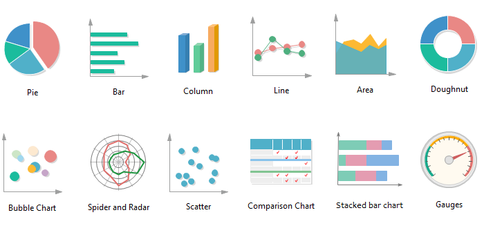

```{r setup, include=FALSE, echo=FALSE, warning=FALSE, message = FALSE}
#                      -=( Install & Load Package Function )=-
install_load <- function (package1, ...)  {   

   # convert arguments to vector
   packages <- c(package1, ...)

   # start loop to determine if each package is installed
   for(package in packages){

       # if package is installed locally, load
       if(package %in% rownames(installed.packages()))
          do.call('library', list(package))

       # if package is not installed locally, download, then load
       else {
          install.packages(package)
          do.call("library", list(package))
       }
   } 
}

install_load("ggplot2","viridis","dplyr","DT")
# install.packages("ggplot2"); library(ggplot2)
# install.packages("viridis"); library(viridis)
# install.packages("dplyr"); library(dplyr)
# webshot::install_phantomjs()

path <- function() gsub  ( "\\\\",  "/",  readClipboard ()  )
```

```{r , include=FALSE, echo=FALSE, warning=FALSE, message = FALSE}
#Set Working Directory
require("knitr")
opts_knit$set(root.dir = "C:/Users/Fathan/Documents/Obsidian Vault/2. Kuliah/Smt 7 & 8/Visdat-25/Prak 02")
```

```{r}
setwd("C:/Users/Fathan/Documents/Obsidian Vault/2. Kuliah/Smt 7 & 8/Visdat-25/Prak 02")
```

# Materi Praktikum

{width="500px" style="display: block; margin: auto;"}

Materi yang akan dibahas dalam praktikum ini adalah:

-   [Perbandingan Kategori](#perbandingan-kategori)
-   [Distribusi](#distribusi)
-   [Deret Waktu](#deret-waktu)
-   [Geospasial](#geospasial)

------------------------------------------------------------------------

# Perbandingan Kategori {#perbandingan-kategori}

## Diagram Batang (Barchart) & Variasinya {#barchart}

Diagram batang digunakan untuk membandingkan kategori. Variasinya meliputi: - Paired bar - Stacked bar - Diverging bar - dll.

## Dot Plot {#dot-plot}

Dot plot digunakan untuk menunjukkan distribusi frekuensi dengan titik.

## Marimekko & Mosaic Chart {#marimekko-mosaic}

Visualisasi untuk membandingkan proporsi dua variabel kategori.

## Unit, Isotype, & Waffle Chart {#unit-chart}

Digunakan untuk menampilkan proporsi dalam bentuk ikon atau blok.

## Heatmap {#heatmap}

Visualisasi matriks yang menggunakan warna untuk mewakili nilai numerik.

## Gauge & Bullet Chart {#gauge-bullet}

Menampilkan pengukuran dalam format indikator atau skala.

## Bubble & Nested Bubbles Chart {#bubble-chart}

Digunakan untuk menunjukkan hierarki atau hubungan antar data.

## Sankey Diagram {#sankey}

Diagram aliran yang menunjukkan hubungan antar kategori.

## Waterfall Chart {#waterfall}

Menunjukkan perubahan nilai dalam urutan kumulatif.

------------------------------------------------------------------------

# Distribusi {#distribusi}

## Histogram {#histogram}

Visualisasi distribusi data berbasis frekuensi dalam bentuk batang.

## Pyramid Chart {#pyramid-chart}

Digunakan untuk membandingkan distribusi kategori dua arah (misalnya populasi pria vs wanita).

## Visualizing Statistical Uncertainty {#statistical-uncertainty}

Metode visualisasi ketidakpastian statistik dalam data.

## Boxplot {#boxplot}

Menampilkan lima ringkasan data: minimum, Q1, median, Q3, dan maksimum.

## Candlestick Chart {#candlestick-chart}

Digunakan dalam analisis keuangan untuk menunjukkan harga tertinggi, terendah, pembukaan, dan penutupan.

## Violin Chart {#violin-chart}

Kombinasi antara boxplot dan density plot untuk memahami distribusi data.

## Ridgeline Plot {#ridgeline-plot}

Menunjukkan distribusi data yang saling tumpang tindih dalam satu grafik.

## Diagram Dahan Daun (Stem-and-Leaf) {#stem-leaf}

Digunakan untuk menampilkan distribusi angka dengan tetap mempertahankan nilai aslinya.

------------------------------------------------------------------------

# Deret Waktu {#deret-waktu}

## Line Chart {#line-chart}

Grafik garis untuk menunjukkan perubahan data dalam rentang waktu tertentu.

## Circular Line Chart {#circular-line-chart}

Versi melingkar dari grafik garis, sering digunakan untuk data musiman.

## Slope Chart {#slope-chart}

Menunjukkan perubahan data antara dua titik waktu.

## Sparklines {#sparklines}

Garis kecil yang menunjukkan tren singkat dalam dataset.

## Bump Chart {#bump-chart}

Menampilkan perubahan peringkat suatu kategori seiring waktu.

## Cycle Chart {#cycle-chart}

Menggambarkan pola siklus dalam data deret waktu.

## Area Chart & Stacked Area Chart {#area-chart}

Memvisualisasikan perubahan dalam data kuantitatif menggunakan area yang diisi warna.

## Streamgraph {#streamgraph}

Menampilkan perubahan dalam data kategorikal dengan bentuk yang mengalir.

## Horizon Chart {#horizon-chart}

Efektif untuk menampilkan data deret waktu dengan skala besar.

## Gantt Chart {#gantt-chart}

Digunakan untuk perencanaan proyek dan menunjukkan jadwal tugas dalam waktu tertentu.

## Flow Chart & Timeline {#flow-chart}

Menunjukkan urutan kejadian atau alur kerja dalam bentuk diagram.

## Connected Scatterplot {#connected-scatterplot}

Scatterplot dengan garis yang menghubungkan titik-titik berdasarkan urutan waktu.

------------------------------------------------------------------------

# Geospasial {#geospasial}

## Choropleth Map {#choropleth-map}

Peta yang menggunakan warna untuk mewakili nilai numerik dalam wilayah geografis.

## Cartogram {#cartogram}

Peta di mana ukuran geografis diubah berdasarkan nilai data.

## Proportional Symbol & Dot Density Maps {#dot-density}

-   **Proportional symbol map**: menggunakan simbol dengan ukuran berbeda untuk mewakili nilai data.
-   **Dot density map**: menyebarkan titik dalam area geografis untuk menunjukkan kepadatan.

## Flow Map {#flow-map}

Menunjukkan pergerakan data (misalnya migrasi populasi, aliran lalu lintas) dalam peta.

> Data Susenas Provinsi Jawa Barat tahun 2020

```{r}
susenas <- read.csv("Data/Susenas Jawa Barat 2020.csv", sep = ";")
head(susenas)
```

```{r}
namakabupaten <- read.csv("Data/nama kabupaten.csv",sep = ",")
head(namakabupaten)
```

## Data P**reprocessing**

```{r}
datakab <- namakabupaten[
  namakabupaten$nama_prov == "JAWA BARAT", 
  c("nama_kab", "kab")
]
colnames(datakab) <- c("Nama Kabupaten", "KabKota")

data <- merge(susenas, datakab, by="KabKota")
head(data)
```

## Data Quality Checking

```{r}
sum(is.na(data))
```

```{r}
str(data)
```

```{r}
table(data[data$`Nama Kabupaten` == "BANDUNG", ]$KabKota)
```

# Bar Chart

## Sederhana

```{r fig.height=3.5, fig.width=10, dpi=300}
ggplot(data, aes(Status_Rawan)) + 
  geom_bar()
```

> **Dengan Warna default**

```{r fig.height=3.5, fig.width=10, dpi=300}
ggplot(data, aes(Status_Rawan, fill=Status_Rawan)) + 
  geom_bar()
```

> **Warna Viridis**

```{r fig.height=3.5, fig.width=10, dpi=300}
ggplot(data, aes(Status_Rawan, fill=Status_Rawan)) + 
  geom_bar() + 
  scale_fill_viridis(discrete = T)
```

> **Warna manual**

```{r fig.height=3.5, fig.width=10, dpi=300}
ggplot(data, aes(Status_Rawan, fill=Status_Rawan)) + 
  geom_bar() + 
  scale_fill_manual(values = c("#FF6961", "#8CD47E"))
```

## Banyak Kategori

```{r fig.height=3.5, fig.width=10, dpi=300}
ggplot(data, aes(`Nama Kabupaten`, fill=`Nama Kabupaten`)) + 
  geom_bar() + 
  scale_fill_viridis(discrete = T)
```

> **Ubah angle text**

```{r fig.height=5, fig.width=10, dpi=300}
ggplot(data, aes(`Nama Kabupaten`, fill=`Nama Kabupaten`)) + 
  geom_bar() + 
  scale_fill_viridis(discrete = T) + 
  theme(axis.text.x = element_text(angle = 90, vjust = 0.5, hjust = 1))
```

```{r fig.height=5, fig.width=10, dpi=300}
ggplot(data, aes(`Nama Kabupaten`, fill=`Nama Kabupaten`)) + 
  geom_bar() + 
  scale_fill_viridis(discrete = T) + 
  theme(axis.text.x = element_text(angle = 75, vjust = 1, hjust = 1))
```

> **Hapus legend**

```{r fig.height=3.5, fig.width=10, dpi=300}
ggplot(data, aes(`Nama Kabupaten`, fill=`Nama Kabupaten`)) + 
  geom_bar() + 
  scale_fill_viridis(discrete = T) + 
  theme(axis.text.x = element_text(angle = 75, vjust = 1, hjust = 1), 
        legend.position = "none") + ylab("Frekuensi")
```

> **Rotasi Barchart**

```{r fig.height=3.5, fig.width=10, dpi=300}
ggplot(data, aes(y = `Nama Kabupaten`, fill=`Nama Kabupaten`)) + 
  geom_bar() + 
  scale_fill_viridis(discrete = T) + 
  theme(axis.text.x = element_text(angle = 90, vjust = 0.5, hjust = 1), 
        legend.position = "none") + 
  xlab("Frekuensi")
```

```{r fig.height=3.5, fig.width=10, dpi=300}
ggplot(data, aes(`Nama Kabupaten`, fill=`Nama Kabupaten`)) + 
  geom_bar() + 
  scale_fill_viridis(discrete = T) + 
  theme(axis.text.x = element_text(angle = 90, vjust = 0.5, hjust = 1), 
        legend.position = "none") + 
  ylab("Frekuensi") + 
  coord_flip() + 
  ggtitle("Diagram Batang Kabupaten")
```

# Grouped Bar Chart

```{r fig.height=3.5, fig.width=10, dpi=300}
ggplot(data, aes(x=`Nama Kabupaten`, fill=Status_Rawan)) + 
  geom_bar(position="dodge")
```

## Stacked Barchart

```{r fig.height=3.5, fig.width=10, dpi=300}
ggplot(data, aes(x=`Nama Kabupaten`, fill=Status_Rawan)) + 
  geom_bar(position="stack")
```

## Stacked Barchart 100%

```{r fig.height=3.5, fig.width=10, dpi=300}
ggplot(data, aes(x=`Nama Kabupaten`, fill=Status_Rawan)) + 
  geom_bar(position="fill")
```

```{r}
percentDatadaerah <- data %>% 
  group_by(`Nama Kabupaten`) %>% 
  count(Status_Rawan) %>% 
  mutate(ratio=scales::percent(n/sum(n)))

head(percentDatadaerah)
```

```{r fig.height=5, fig.width=7, dpi=300}
ggplot(data, aes(x=`Nama Kabupaten`, fill=Status_Rawan)) + 
  geom_bar(position="fill") + 
  theme(axis.text.x = element_text(angle = 90, vjust = 0.5, hjust = 1)) + 
  coord_flip() +
  geom_text(data=percentDatadaerah, aes(y=n, label=ratio),
            color="white", position=position_fill(vjust=0.5), size = 3.5)
```

# Lollipop Chart

```{r}
percentDatadaerah_rawan <- percentDatadaerah %>%
  filter(Status_Rawan == "Rawan") %>%
  as.data.frame()
head(percentDatadaerah_rawan)
```

```{r}
ggplot(percentDatadaerah_rawan, aes(x=`Nama Kabupaten`, y=n)) + 
  geom_segment(aes(x=`Nama Kabupaten`, xend=`Nama Kabupaten`, y=0, yend=n)) +
  geom_point() + coord_flip()
```

```{r}
ggplot(percentDatadaerah_rawan, aes(x = `Nama Kabupaten`, y = n)) + geom_segment(aes(x = `Nama Kabupaten`, xend = `Nama Kabupaten`, y = 0, yend = n)) + geom_point() + coord_flip() + geom_point(size = 4, pch = 21, bg = 5, col = 6)
```

```{r}
ggplot(percentDatadaerah_rawan, aes(x = `Nama Kabupaten`, y = n)) + geom_segment(aes(x = `Nama Kabupaten`, xend = `Nama Kabupaten`, y = 0, yend = n), color="grey", lwd=1.5) + geom_point() + coord_flip() + geom_point(size = 5, pch = 21, bg = 6, col = 1) + theme_classic()
```

```{r}
ggplot(percentDatadaerah_rawan, aes(x = `Nama Kabupaten`, y = n)) + geom_segment(aes(x = `Nama Kabupaten`, xend = `Nama Kabupaten`, y = 0, yend = n), color="grey", lwd=1.5) + geom_point() + coord_flip() + geom_point(size = 5, pch = 21, bg = 6, col = 1) + theme_classic()
```

```{r}
ggplot(percentDatadaerah_rawan, aes(x = `Nama Kabupaten`, y = n)) + geom_segment(aes(x = `Nama Kabupaten`, xend = `Nama Kabupaten`, y = 0, yend = n), color="grey", lwd=1.5) + geom_point() + coord_flip() + geom_point(size = 5, pch = 21, bg = 6, col = 1) + geom_text(aes(label = n), color = "white", size = 2) + theme_classic() 
```

```{r}
x = reorder(percentDatadaerah_rawan$`Nama Kabupaten`, percentDatadaerah_rawan$n)
x
```

```{r}
ggplot(percentDatadaerah_rawan, aes(x = reorder(`Nama Kabupaten`, n), y = n)) + geom_segment(aes(xend = `Nama Kabupaten`, y = 0, yend = n), color="grey", lwd=1.5) + geom_point() + coord_flip() + geom_point(size = 5, pch = 21, bg = 6, col = 1) + geom_text(aes(label = n), color = "white", size = 2) + theme_classic()
```
