```{r setup, include=FALSE, echo=FALSE, warning=FALSE, message = FALSE}
#                      -=( Install & Load Package Function )=-
install_load <- function (package1, ...)  {   

   # convert arguments to vector
   packages <- c(package1, ...)

   # start loop to determine if each package is installed
   for(package in packages){

       # if package is installed locally, load
       if(package %in% rownames(installed.packages()))
          do.call('library', list(package))

       # if package is not installed locally, download, then load
       else {
          install.packages(package)
          do.call("library", list(package))
       }
   } 
}

install_load("knitr","ggplot2","viridis","dplyr","DT")

# Change \ to /
path <- function() gsub  ( "\\\\",  "/",  readClipboard ()  )

# Set WD
opts_knit$set(root.dir = "C:/Users/Fathan/Documents/Obsidian Vault/2. Kuliah/Smt 7 & 8/Visdat-25/Prak 02")
```

```{r}
setwd("C:/Users/Fathan/Documents/Obsidian Vault/2. Kuliah/Smt 7 & 8/Visdat-25/Prak 02")
```

# **Materi Praktikum**

{width="500px" style="display: block; margin: auto;"}

Materi yang akan dibahas dalam praktikum ini adalah:

-   [Perbandingan Kategori](#perbandingan-kategori)
-   [Deret Waktu](#deret-waktu)
-   [Distribusi](#distribusi)
-   [Geospasial](#geospasial)

------------------------------------------------------------------------

# **Perbandingan Kategori** {#perbandingan-kategori}

## Bar Charts {#barchart}

Diagram batang digunakan untuk membandingkan kategori.

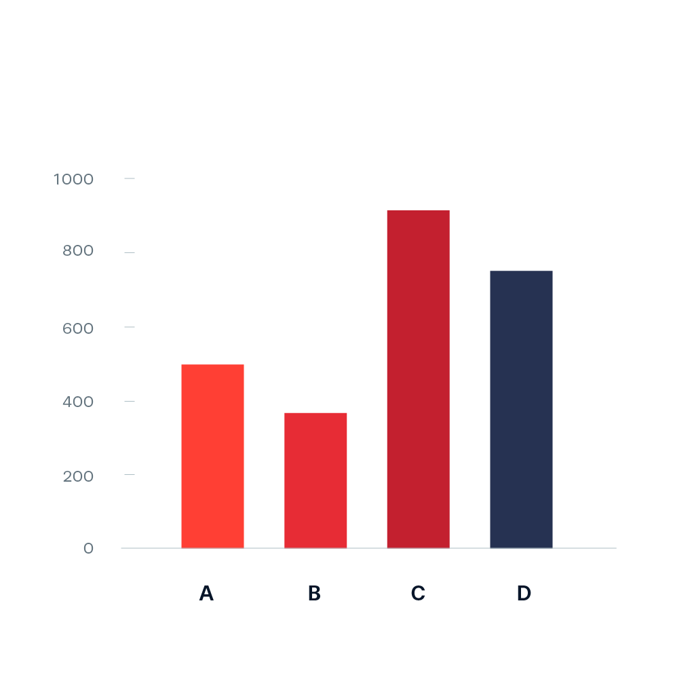{width="169"}

## Paired Bar {#paired-bar}

Membandingkan dua set kategori yang terkait.

{width="170"}

## Stacked Bar {#stacked-bar}

Menampilkan perbandingan komposisi antar kategori.

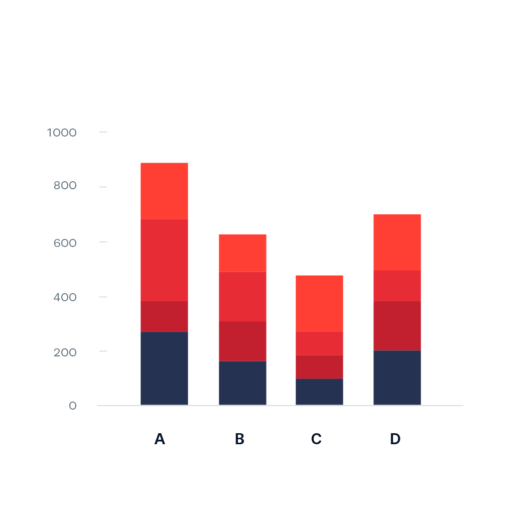{width="174"}

## Diverging Bar {#diverging-bar}

Menunjukkan distribusi kategori dengan skala positif-negatif.

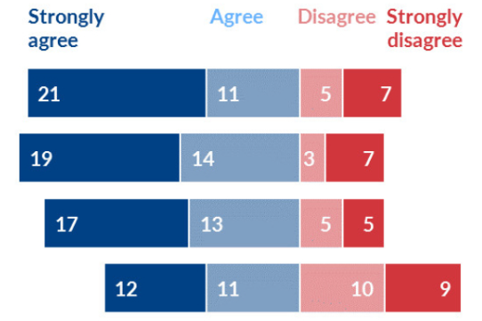{width="216"}

## Dot Plot {#dot-plot}

Digunakan untuk menunjukkan distribusi atau perbandingan antar kategori.

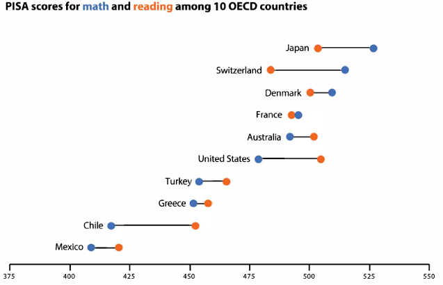{width="308"}

## Marimekko and Mosaic Charts {#marimekko-mosaic}

Visualisasi untuk membandingkan proporsi dua variabel kategori.

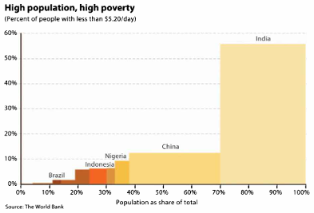{width="291"} 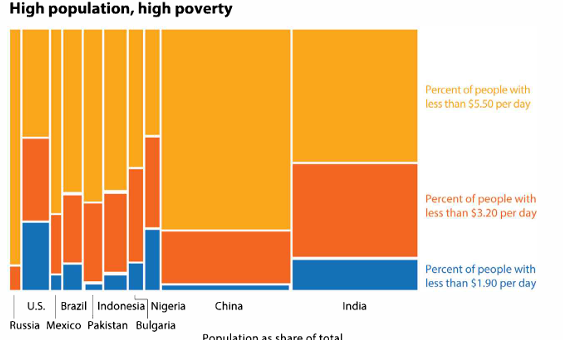{width="324"}

## Unit, Isotype, and Waffle Charts {#unit-chart}

Digunakan untuk menampilkan proporsi dalam bentuk ikon atau blok.

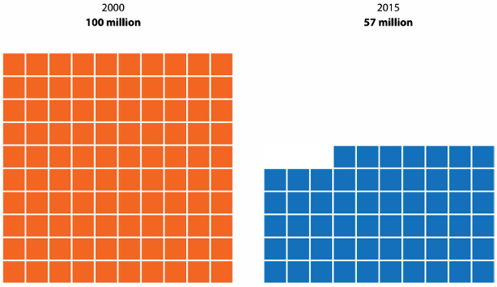{width="203"} {width="269"} 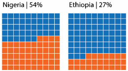{width="201"}

## Heatmap {#heatmap}

Visualisasi matriks yang menggunakan warna untuk mewakili nilai numerik.

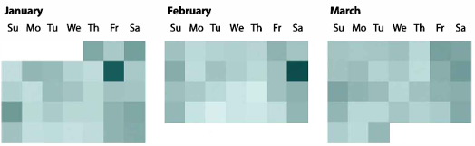{width="371"}

## Gauge and Bullet Charts {#gauge-bullet}

Menampilkan pengukuran dalam format indikator atau skala.

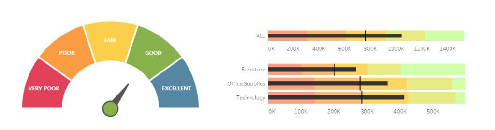{width="469"}

## Bubble Comparison and Nested Bubbles {#bubble-chart}

Digunakan untuk menunjukkan hierarki atau hubungan antar data.

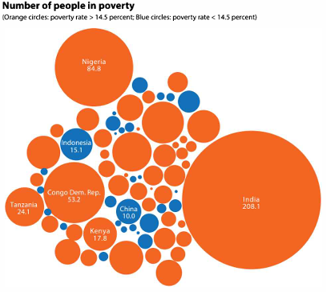{width="214"} 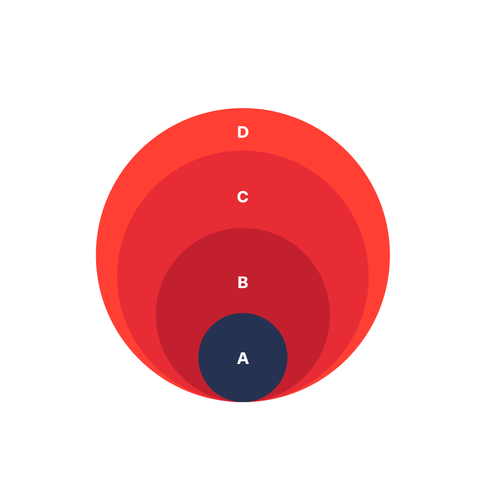{width="189"}

## Sankey Diagram {#sankey}

Diagram aliran yang menunjukkan hubungan antar kategori.

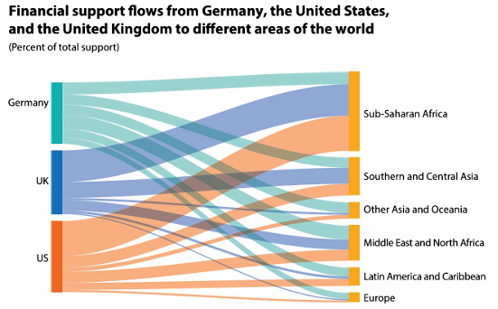{width="259"} 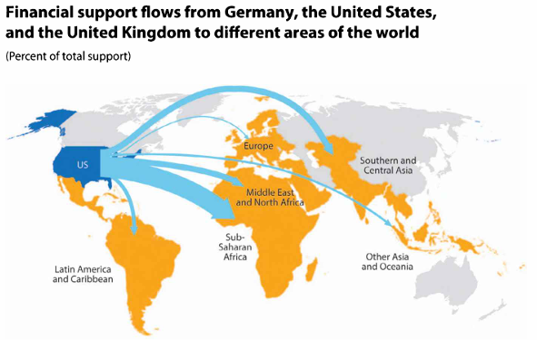{width="254"}

## Waterfall Chart {#waterfall}

Menunjukkan perubahan nilai dalam urutan kumulatif.

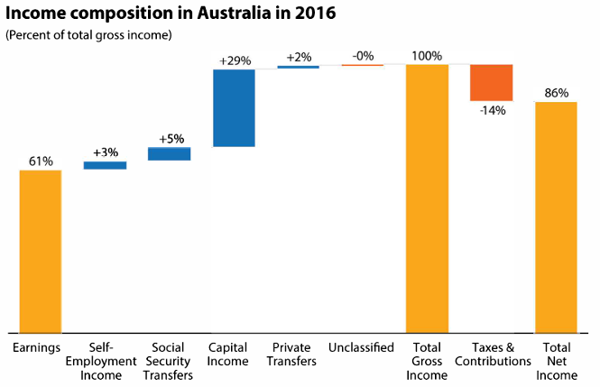{width="244"}

## Conclusion

Ringkasan konsep perbandingan kategori.

------------------------------------------------------------------------

# **Deret Waktu** {#deret-waktu}

## Line Chart {#line-chart}

Grafik garis untuk menunjukkan perubahan data dalam rentang waktu tertentu.

## Circular Line Chart {#circular-line-chart}

Versi melingkar dari grafik garis, sering digunakan untuk data musiman.

## Slope Chart {#slope-chart}

Menunjukkan perubahan data antara dua titik waktu.

## Sparklines {#sparklines}

Garis kecil yang menunjukkan tren singkat dalam dataset.

## Bump Chart {#bump-chart}

Menampilkan perubahan peringkat suatu kategori seiring waktu.

## Cycle Chart {#cycle-chart}

Menggambarkan pola siklus dalam data deret waktu.

## Area Chart & Stacked Area Chart {#area-chart}

Memvisualisasikan perubahan dalam data kuantitatif menggunakan area yang diisi warna.

## Streamgraph {#streamgraph}

Menampilkan perubahan dalam data kategorikal dengan bentuk yang mengalir.

## Horizon Chart {#horizon-chart}

Efektif untuk menampilkan data deret waktu dengan skala besar.

## Gantt Chart {#gantt-chart}

Digunakan untuk perencanaan proyek dan menunjukkan jadwal tugas dalam waktu tertentu.

## Flow Charts and Timelines {#flow-chart}

Menunjukkan urutan kejadian atau alur kerja dalam bentuk diagram.

## Connected Scatterplot {#connected-scatterplot}

Scatterplot dengan garis yang menghubungkan titik-titik berdasarkan urutan waktu.

## Conclusion

Ringkasan konsep visualisasi deret waktu.

------------------------------------------------------------------------

# **Distribusi** {#distribusi}

## Histogram {#histogram}

Visualisasi distribusi data berbasis frekuensi dalam bentuk batang.

## Pyramid Chart {#pyramid-chart}

Digunakan untuk membandingkan distribusi kategori dua arah (misalnya populasi pria vs wanita).

## Visualizing Statistical Uncertainty with Charts {#statistical-uncertainty}

Metode visualisasi ketidakpastian statistik dalam data.

## Box-and-Whisker Plot {#boxplot}

Menampilkan lima ringkasan data: minimum, Q1, median, Q3, dan maksimum.

## Candlestick Chart {#candlestick-chart}

Digunakan dalam analisis keuangan untuk menunjukkan harga tertinggi, terendah, pembukaan, dan penutupan.

## Violin Chart {#violin-chart}

Kombinasi antara boxplot dan density plot untuk memahami distribusi data.

## Ridgeline Plot {#ridgeline-plot}

Menunjukkan distribusi data yang saling tumpang tindih dalam satu grafik.

## Visualizing Uncertainty by Showing the Data {#uncertainty}

Menunjukkan ketidakpastian dalam visualisasi data.

## Stem-and-Leaf Plot {#stem-leaf}

Digunakan untuk menampilkan distribusi angka dengan tetap mempertahankan nilai aslinya.

## Conclusion

Ringkasan konsep visualisasi distribusi data.

------------------------------------------------------------------------

# **Geospasial** {#geospasial}

## Choropleth Map {#choropleth-map}

Peta yang menggunakan warna untuk mewakili nilai numerik dalam wilayah geografis.

## Cartogram {#cartogram}

Peta di mana ukuran geografis diubah berdasarkan nilai data.

## Proportional Symbol and Dot Density Maps {#dot-density}

-   **Proportional symbol map**: menggunakan simbol dengan ukuran berbeda untuk mewakili nilai data.
-   **Dot density map**: menyebarkan titik dalam area geografis untuk menunjukkan kepadatan.

## Flow Map {#flow-map}

Menunjukkan pergerakan data (misalnya migrasi populasi, aliran lalu lintas) dalam peta.

## Conclusion

Ringkasan konsep visualisasi geospasial.
