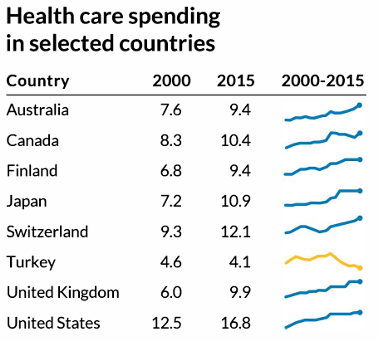

```{r setup, include=FALSE, echo=FALSE, warning=FALSE, message = FALSE}
#                      -=( Install & Load Package Function )=-
install_load <- function (package1, ...)  {   

   # convert arguments to vector
   packages <- c(package1, ...)

   # start loop to determine if each package is installed
   for(package in packages){

       # if package is installed locally, load
       if(package %in% rownames(installed.packages()))
          do.call('library', list(package))

       # if package is not installed locally, download, then load
       else {
          install.packages(package)
          do.call("library", list(package))
       }
   } 
}

install_load("knitr","ggplot2","viridis","dplyr","DT","stringr","scales","tidyr",
             "waffle","ggtext","lubridate","reshape2","calendR","plotly","ggforce"
             ,"ggalluvial","networkD3","ggbump","ggridges")

# Set wd 
opts_knit$set(root.dir = normalizePath("./"))
```

# Materi Praktikum

{width="450"} {width="164"}

Materi praktikum ini merujuk pada **buku *Better Data Visualizations* karya Jonathan Schwabish**, yang membahas berbagai teknik visualisasi data untuk menyampaikan informasi secara lebih efektif dan intuitif.

Dalam praktikum ini, kita akan mengeksplorasi beberapa jenis visualisasi data utama, yaitu:

-   [Perbandingan Kategori](#perbandingan-kategori)
-   [Deret Waktu](#deret-waktu)
-   [Distribusi](#distribusi)
-   [Geospasial](#geospasial)

## Data

Data yang akan digunakan adalah

```{r}
# Data
data_ev <- read.csv("Data/EV_Population.csv")
head(data_ev)
```

------------------------------------------------------------------------

# **Deret Waktu** {#deret-waktu}

## Line Chart {#line-chart}

Grafik garis untuk menunjukkan perubahan data dalam rentang waktu tertentu.

{width="248"}

```{r fig.height=3.5, fig.width=10, dpi=300}
# Buat Data Contoh
data_dual <- data.frame(
  Year = seq(2000, 2018, by = 1),
  Housing_Debt = c(10, 10.2, 10.5, 10.8, 11.2, 11.5, 11.8, 12.3, 12.8, 13.1, 13.4, 13.2, 12.8, 12.3, 11.7, 11.2, 10.8, 10.5, 10.3),
  Unemployment_Rate = c(4, 4.2, 5.0, 5.5, 5.8, 6.0, 6.5, 7.0, 9.0, 10.0, 9.8, 9.5, 8.5, 7.5, 6.3, 5.5, 4.8, 4.2, 3.9)
)

# Reshape data untuk ggplot
data_long <- data_dual %>%
  pivot_longer(cols = c("Housing_Debt", "Unemployment_Rate"),
               names_to = "Variable", values_to = "Value")

# Plot
ggplot(data_long, aes(x = Year, y = Value, color = Variable)) +
  geom_line(size = 1.2) +
  scale_y_continuous(
    name = "Housing Debt (%)",
    sec.axis = sec_axis(~ ., name = "Unemployment Rate (%)")
  ) +
  scale_color_manual(values = c("Housing_Debt" = "blue", "Unemployment_Rate" = "gold")) +
  labs(title = "The Economic Climate for Consumers in 2017 and 2018",
       subtitle = "Comparison of Housing Debt and Unemployment Rate",
       x = "Year",
       y = "Housing Debt (%)") +
  theme_minimal() +
  theme(legend.title = element_blank())
```

## Circular Line Chart {#circular-line-chart}

Versi melingkar dari grafik garis, sering digunakan untuk data musiman.

{width="397"}

```{r fig.height=5, fig.width=10, dpi=300}
# Buat Data Simulasi
set.seed(123)
data_circular <- expand.grid(
  Month = month.abb, 
  Year = c(2014, 2015, 2016, 2017)
) %>%
  mutate(ER_Visits = runif(nrow(.), 1, 6))  # Simulasi data kunjungan IGD

# Konversi Bulan ke Faktor agar sesuai urutan
data_circular$Month <- factor(data_circular$Month, levels = month.abb)

# Plot Circular Line Chart
ggplot(data_circular, aes(x = Month, y = ER_Visits, group = Year, color = as.factor(Year))) +
  geom_line(size = 1) +
  scale_y_continuous(limits = c(0, 7)) +
  coord_polar(start = 3.14) +  # Mengatur agar Januari dimulai dari atas
  scale_color_manual(values = c("2014" = "blue", "2015" = "orange", "2016" = "gray", "2017" = "black")) +
  labs(title = "Percent of ER Visits for the Flu (2014–2017)", 
       subtitle = "Circular Line Chart Representation",
       x = "", y = "Percent ER Visits", color = "Year") +
  theme_minimal() +
  theme(axis.text.x = element_text(size = 10, face = "bold"),
        legend.position = "top")
```

```{r fig.height=3.5, fig.width=10, dpi=300}
# Buat Data Simulasi (Sama seperti sebelumnya)
set.seed(123)
data_line <- expand.grid(
  Month = month.abb, 
  Year = c(2014, 2015, 2016, 2017)
) %>%
  mutate(ER_Visits = runif(nrow(.), 1, 6))  # Simulasi data kunjungan IGD

# Konversi Bulan ke Faktor agar sesuai urutan
data_line$Month <- factor(data_line$Month, levels = month.abb)

# Plot Line Chart Standar
ggplot(data_line, aes(x = Month, y = ER_Visits, group = Year, color = as.factor(Year))) +
  geom_line(size = 1) +
  geom_point(size = 2) +  # Tambahkan titik di setiap bulan
  scale_y_continuous(limits = c(0, 7)) +
  scale_color_manual(values = c("2014" = "blue", "2015" = "orange", "2016" = "gray", "2017" = "black")) +
  labs(title = "Percent of ER Visits for the Flu (2014–2017)", 
       subtitle = "Line Chart Representation",
       x = "Month", y = "Percent ER Visits", color = "Year") +
  theme_minimal() +
  theme(axis.text.x = element_text(size = 10, face = "bold", angle = 45, hjust = 1),
        legend.position = "top")
```

## Slope Chart {#slope-chart}

Menunjukkan perubahan data antara dua titik waktu.

{width="245"}

```{r fig.height=3.5, fig.width=10, dpi=300}
# Buat Data Simulasi
slope_data <- data.frame(
  State = c("Montana", "Hawaii", "Idaho", "Michigan", "North Carolina", "Connecticut"),
  Unemployment_2000 = c(5.1, 4.7, 4.6, 3.3, 3.3, 2.8),  # Data tahun 2000
  Unemployment_2018 = c(4.5, 4.2, 3.8, 4.2, 3.0, 2.3)   # Data tahun 2018
) %>%
  tidyr::pivot_longer(cols = starts_with("Unemployment"), 
                      names_to = "Year", values_to = "Rate") %>%
  mutate(Year = recode(Year, 
                       "Unemployment_2000" = "January 2000", 
                       "Unemployment_2018" = "January 2018"))

# Plot Slope Chart
ggplot(slope_data, aes(x = Year, y = Rate, group = State, color = State)) +
  geom_line(size = 1.2) +  
  geom_point(size = 3) +  
  geom_text(data = slope_data %>% filter(Year == "January 2000"), 
            aes(label = paste0(State, " ", Rate, "%")), 
            hjust = 1.1, size = 4) +  
  geom_text(data = slope_data %>% filter(Year == "January 2018"), 
            aes(label = paste0(Rate, "%")), 
            hjust = -0.1, size = 4) +  
  scale_x_discrete(expand = expansion(mult = c(0.2, 0.2))) +  
  scale_y_continuous(limits = c(2, 6)) +
  labs(title = "Biggest Changes in the Unemployment Rate",
       subtitle = "Between January 2000 and January 2018",
       x = "", y = "Unemployment Rate (%)") +
  theme_minimal() +
  theme(legend.position = "none",
        axis.text.x = element_text(size = 12, face = "bold"),
        axis.text.y = element_text(size = 10),
        plot.title = element_text(size = 14, face = "bold"),
        plot.subtitle = element_text(size = 12))
```

## Sparklines {#sparklines}

Garis kecil yang menunjukkan tren singkat dalam dataset.

{width="207"}

## Bump Chart {#bump-chart}

Menampilkan perubahan peringkat suatu kategori seiring waktu.

{width="498"}

```{r fig.height=3.5, fig.width=10, dpi=300}
# Buat Data Simulasi
bump_data <- data.frame(
  Year = rep(seq(2000, 2015, 5), each = 8),  # Tahun dalam interval 5 tahun
  Country = rep(c("United States", "Switzerland", "Germany", "France", "Sweden",
                  "Japan", "Netherlands", "Canada"), times = 4),
  Rank = c(1, 2, 3, 4, 5, 6, 7, 8,
           1, 2, 4, 3, 6, 5, 8, 7,
           1, 2, 3, 5, 4, 7, 6, 8,
           1, 2, 3, 4, 5, 6, 7, 8)  # Peringkat tiap negara
)

# Plot Bump Chart
ggplot(bump_data, aes(x = Year, y = Rank, group = Country, color = Country)) +
  geom_bump(size = 1.5) +  # Garis smooth bump chart
  geom_point(size = 3) +  # Titik pada setiap peringkat
  geom_text(aes(label = Country), data = bump_data %>% filter(Year == max(Year)), 
            hjust = -0.2, size = 4, fontface = "bold") +  # Label negara di akhir
  scale_y_reverse(breaks = 1:8) +  # Mengurutkan peringkat dari atas ke bawah
  scale_x_continuous(breaks = seq(2000, 2015, 5)) +
  labs(title = "Ranks of Health Care Spending Among Major Countries",
       x = "Year", y = "Rank") +
  theme_minimal() +
  theme(legend.position = "none", 
        panel.grid.major.x = element_blank(),
        panel.grid.minor.x = element_blank(),
        axis.text.x = element_text(size = 10),
        axis.text.y = element_text(size = 10))
```

## Cycle Chart {#cycle-chart}

**Cycle Chart** adalah grafik yang digunakan untuk **membandingkan pola data dalam unit waktu kecil (minggu, bulan, dll.) dalam jangka waktu multi-tahun**. Grafik ini berguna untuk **menampilkan tren musiman** dalam data.

{width="249"}

## Area Chart {#area-chart}

**Area Chart** adalah varian dari **line chart** di mana **area di bawah garis diisi dengan warna** untuk memberikan bobot visual yang lebih jelas pada data. Grafik ini digunakan untuk **menunjukkan tren perubahan nilai numerik dari waktu ke waktu**.

{width="213"}

```{r fig.height=3.5, fig.width=10, dpi=300}
# Buat Data Simulasi
set.seed(123)
data <- data.frame(
  x = seq(0, 10, by = 1),
  y = cumsum(runif(11, min = -50, max = 100)) + 200  # Nilai kumulatif agar ada pola naik-turun
)

# Plot Area Chart
ggplot(data, aes(x = x, y = y)) +
  geom_area(fill = "red", alpha = 0.8) +  # Area dengan warna merah
  theme_minimal() +
  labs(title = "Area Chart", x = "", y = "")
```

## Stacked Area Chart {#stacked-area-chart}

{width="209" height="209"}

**Stacked Area Chart** adalah varian dari **area chart** yang digunakan untuk **menampilkan beberapa seri data secara simultan**, di mana setiap area saling ditumpuk sehingga nilai totalnya dapat terlihat dengan jelas. Grafik ini sering digunakan untuk **menunjukkan perubahan distribusi data seiring waktu**.

```{r fig.height=3.5, fig.width=10, dpi=300}
# Buat Data Simulasi
set.seed(123)
data <- data.frame(
  x = rep(seq(0, 10, by = 1), 3),   # Sumbu X yang sama untuk semua kategori
  y = cumsum(runif(11, min = 50, max = 150)),  # Seri 1
  y2 = cumsum(runif(11, min = 40, max = 120)), # Seri 2
  y3 = cumsum(runif(11, min = 30, max = 90))   # Seri 3
)

# Ubah Data ke Format Long
data_long <- data %>%
  pivot_longer(cols = c(y, y2, y3), names_to = "Category", values_to = "Value")

# Plot Stacked Area Chart
ggplot(data_long, aes(x = x, y = Value, fill = Category)) +
  geom_area(alpha = 0.8) +  # Area chart dengan transparansi
  scale_fill_manual(values = c("#1C1F38", "#E63946", "#F76C5E")) +  # Warna seperti di gambar
  theme_minimal() +
  labs(title = "Stacked Area Chart", x = "", y = "")
```

## Streamgraph {#streamgraph}

Menampilkan perubahan dalam data kategorikal dengan bentuk yang mengalir.

{width="209"}

## Horizon Chart {#horizon-chart}

**Horizon Chart** adalah varian dari **Area Chart** yang digunakan untuk menampilkan **data deret waktu dengan cara yang lebih padat dan efisien**. Grafik ini bekerja dengan **membagi area chart menjadi beberapa band horizontal**, lalu **menumpuknya untuk mengurangi ruang yang digunakan**.

{width="284"}

## Gantt Chart {#gantt-chart}

**Gantt Chart** adalah jenis grafik yang digunakan untuk **menampilkan jadwal, proses, atau durasi tugas** dengan **menggunakan batang horizontal**. Grafik ini sering digunakan dalam **manajemen proyek, shift kerja, dan pelacakan jadwal produksi**.

{width="294"}

```{r fig.height=3.5, fig.width=10, dpi=300}
# Buat dataset proyek simulasi
gantt_data <- data.frame(
  Task = factor(paste("Task", 1:10), levels = rev(paste("Task", 1:10))),  # Nama tugas (dibalik untuk urutan yang lebih baik)
  Start = seq(1, 40, by = 4),  # Hari mulai
  Duration = c(3, 5, 6, 4, 8, 7, 6, 5, 4, 3)  # Durasi dalam hari
)

# Tambahkan kolom End (Hari selesai)
gantt_data <- gantt_data %>%
  mutate(End = Start + Duration)

# Plot Gantt Chart
ggplot(gantt_data, aes(y = Task, xmin = Start, xmax = End, fill = Task)) +
  geom_rect(aes(xmin = Start, xmax = End, ymin = as.numeric(Task) - 0.4, ymax = as.numeric(Task) + 0.4),
            color = "black") +
  scale_fill_viridis_d() +  
  labs(title = "Gantt Chart",
       x = "Start on Day",
       y = "Task") +
  theme_minimal() +
  theme(legend.position = "none")
```

## Flow Charts and Timelines {#flow-chart}

Flow Charts dan Timelines adalah dua jenis visualisasi yang digunakan untuk **menampilkan perubahan, proses, atau hierarki** secara kronologis atau langkah demi langkah.

{width="239"}

## Connected Scatterplot {#connected-scatterplot}

**Connected Scatterplot** adalah metode visualisasi yang digunakan untuk **menunjukkan hubungan antara dua deret waktu dalam satu grafik**, tanpa menggunakan **dual-axis line chart**.

{width="211"} {width="419"}

```{r fig.height=3.5, fig.width=10, dpi=300}

```

## Conclusion

Ringkasan konsep visualisasi deret waktu.

------------------------------------------------------------------------
