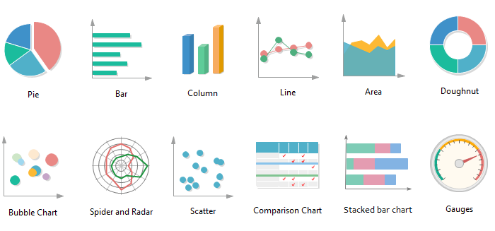
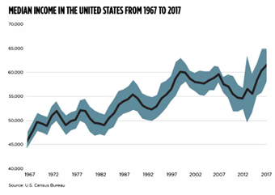
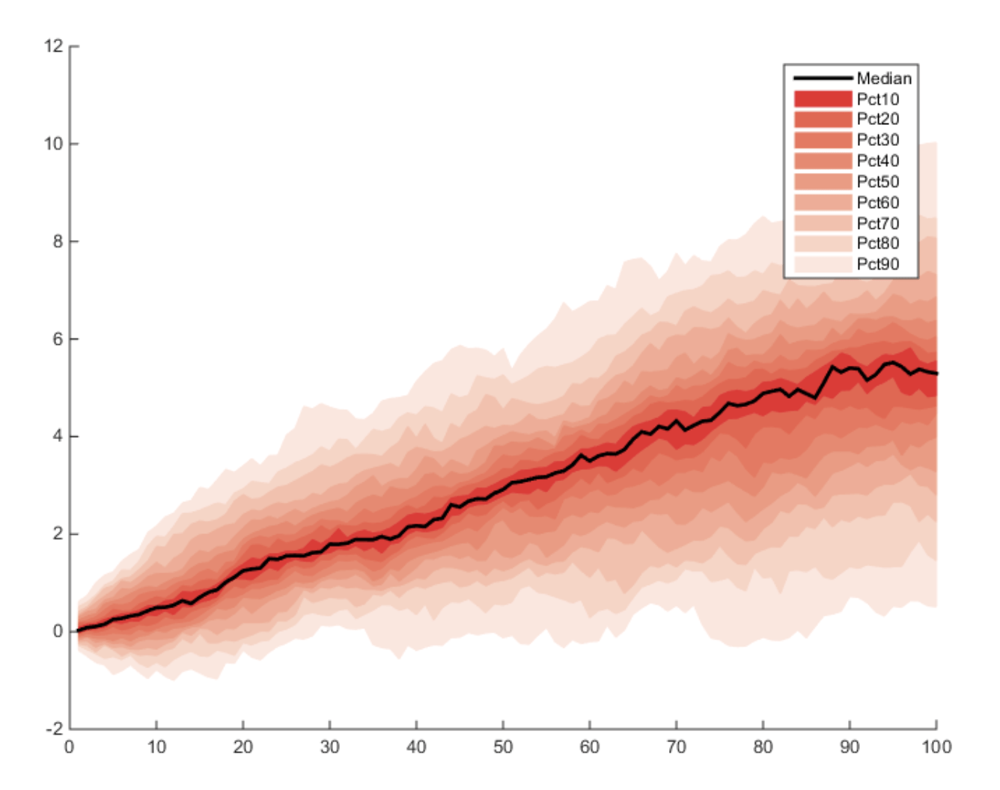
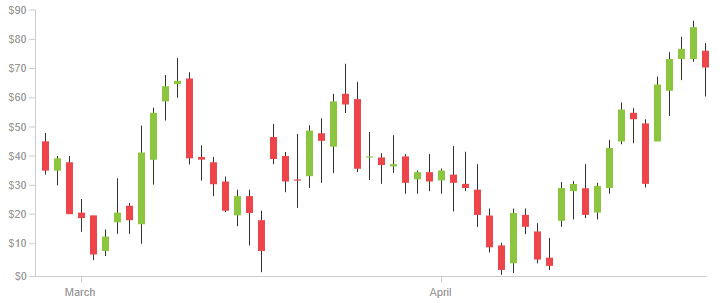
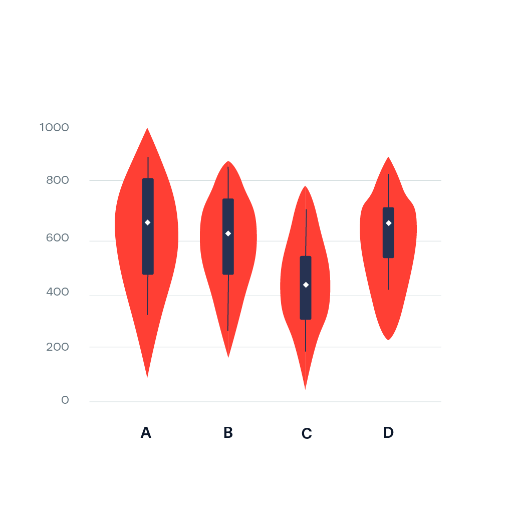
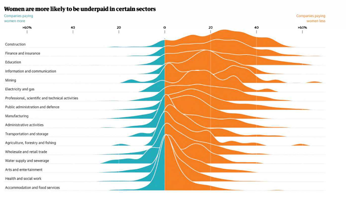
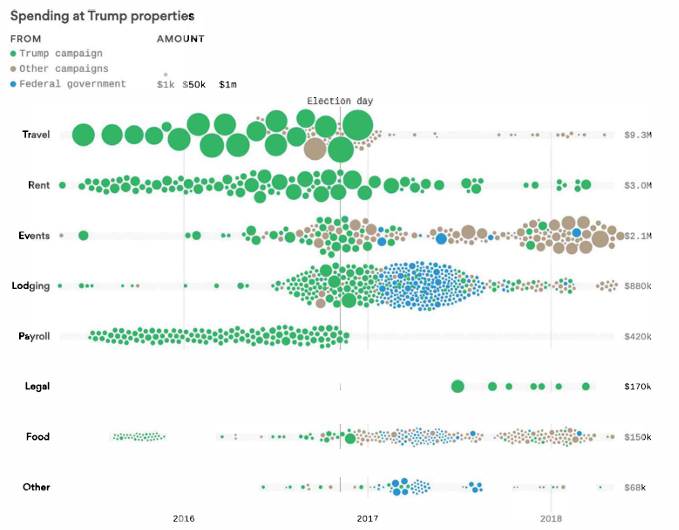
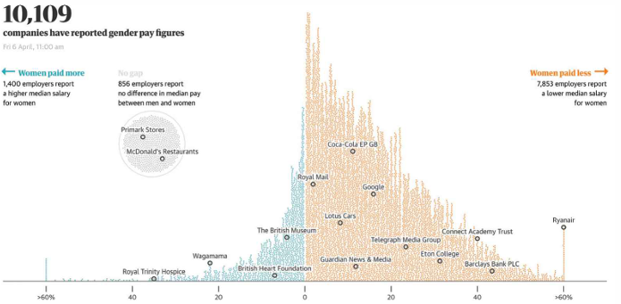

```{r setup, include=FALSE, echo=FALSE, warning=FALSE, message = FALSE}
#                      -=( Install & Load Package Function )=-
install_load <- function (package1, ...)  {   

   # convert arguments to vector
   packages <- c(package1, ...)

   # start loop to determine if each package is installed
   for(package in packages){

       # if package is installed locally, load
       if(package %in% rownames(installed.packages()))
          do.call('library', list(package))

       # if package is not installed locally, download, then load
       else {
          install.packages(package)
          do.call("library", list(package))
       }
   } 
}

install_load("knitr","ggplot2","viridis","dplyr","DT")

# Set wd 
opts_knit$set(root.dir = normalizePath("./"))
```

# Materi Praktikum

{width="450"} {width="164"}

Materi praktikum ini merujuk pada **buku *Better Data Visualizations* karya Jonathan Schwabish**, yang membahas berbagai teknik visualisasi data untuk menyampaikan informasi secara lebih efektif dan intuitif.

Dalam praktikum ini, kita akan mengeksplorasi beberapa jenis visualisasi data utama, yaitu:

-   [Perbandingan Kategori](#perbandingan-kategori)
-   [Deret Waktu](#deret-waktu)
-   [Distribusi](#distribusi)
-   [Geospasial](#geospasial)

## Data

Data yang akan digunakan adalah

```{r}
# Data
data_ev <- read.csv("Data/EV_Population.csv")
head(data_ev)
```

------------------------------------------------------------------------

# **Distribusi** {#distribusi}

## Histogram {#histogram}

Visualisasi distribusi data berbasis frekuensi dalam bentuk batang.

{width="202"}

```{r fig.height=3.5, fig.width=10, dpi=300}
# Buat data simulasi
set.seed(123)  # Untuk reproduksibilitas
data_hist <- data.frame(
  Value = rnorm(1000, mean = 80, sd = 5)  # 1000 sampel dengan distribusi normal
)

# Buat Histogram
ggplot(data_hist, aes(x = Value)) +
  geom_histogram(binwidth = 2, fill = "red", color = "white") +  # Batang histogram
  labs(title = "Histogram Distribusi Data", x = "Nilai", y = "Frekuensi") +
  theme_minimal()

```

## Pyramid Chart {#pyramid-chart}

Digunakan untuk membandingkan distribusi kategori dua arah (misalnya populasi pria vs wanita).

{width="198"}

## **Visualizing Statistical Uncertainty with Charts** {#statistical-uncertainty}

Metode visualisasi ketidakpastian statistik dalam data.

### Error Bars

{width="172"}

### Confidence Interval

{width="229"}

### Gradient Chart

{width="293"}

### Fan Charts

{width="254" height="201"}

## Box-and-Whisker Plot {#boxplot}

Menampilkan lima ringkasan data: minimum, Q1, median, Q3, dan maksimum.

{width="222"}

## Candlestick Chart {#candlestick-chart}

Digunakan dalam analisis keuangan untuk menunjukkan harga tertinggi, terendah, pembukaan, dan penutupan.

{width="318"}

## Violin Chart {#violin-chart}

Kombinasi antara boxplot dan density plot untuk memahami distribusi data.

{width="194" height="194"}

## Ridgeline Plot {#ridgeline-plot}

Menunjukkan distribusi data yang saling tumpang tindih dalam satu grafik.

{width="283"}

## **Showing the Data** {#uncertainty}

### Strip Plot

{width="177"}

### Beeswarm Plot

{width="177"} {width="227"}

### Wilkinson Dot Plots and Wheat Plot

{width="161" height="89"} {width="315"}

### Raincloud Plot

{width="327"}

## Stem-and-Leaf Plot {#stem-leaf}

Digunakan untuk menampilkan distribusi angka dengan tetap mempertahankan nilai aslinya.


## Conclusion

Ringkasan konsep visualisasi distribusi data.

------------------------------------------------------------------------
