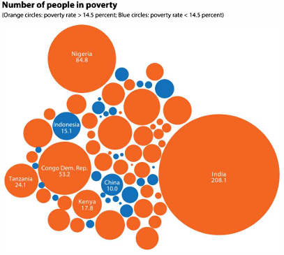
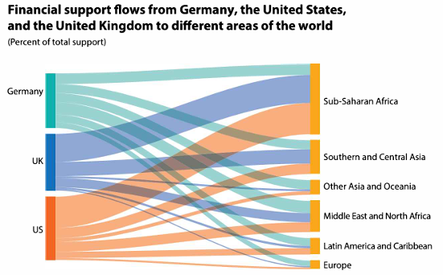
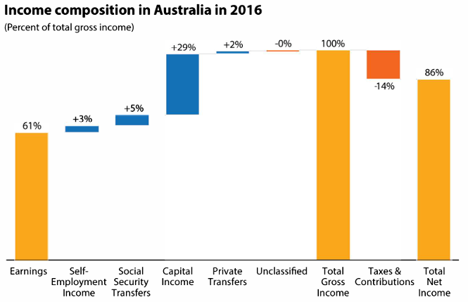

```{r setup, include=FALSE, echo=FALSE, warning=FALSE, message = FALSE}
#                      -=( Install & Load Package Function )=-
install_load <- function (package1, ...)  {   

   # convert arguments to vector
   packages <- c(package1, ...)

   # start loop to determine if each package is installed
   for(package in packages){

       # if package is installed locally, load
       if(package %in% rownames(installed.packages()))
          do.call('library', list(package))

       # if package is not installed locally, download, then load
       else {
          install.packages(package)
          do.call("library", list(package))
       }
   } 
}

install_load("knitr","ggplot2","viridis","dplyr","DT","stringr")

# Set wd 
opts_knit$set(root.dir = normalizePath("./"))

# Folder Chart
if (!dir.exists("Chart")) {
  dir.create("Chart")
}
```

# Materi Praktikum

{width="450"} {width="164"}

Materi praktikum ini merujuk pada **buku *Better Data Visualizations* karya Jonathan Schwabish**, yang membahas berbagai teknik visualisasi data untuk menyampaikan informasi secara lebih efektif dan intuitif.

Dalam praktikum ini, kita akan mengeksplorasi beberapa jenis visualisasi data utama, yaitu:

-   [Perbandingan Kategori](#perbandingan-kategori)
-   [Deret Waktu](#deret-waktu)
-   [Distribusi](#distribusi)
-   [Geospasial](#geospasial)

## Data

-   [Placement Prediction Dataset](https://www.kaggle.com/datasets/ruchikakumbhar/placement-prediction-dataset)

-   [Mobile Apps ScreenTime Analysis](https://www.kaggle.com/datasets/anandshaw2001/mobile-apps-screentime-analysis)

-   [Electric Vehicle Population](https://www.kaggle.com/datasets/fatmanur12/electric-vehicle-population)

-   [S&P 500, ETF, FX & Crypto (Daily updated)](https://www.kaggle.com/datasets/benjaminpo/s-and-p-500-with-dividends-and-splits-daily-updated?select=AAPL.csv)

```{r}
data_ev <- read.csv("Data/EV_Population.csv")
```

------------------------------------------------------------------------

# **Perbandingan Kategori** {#perbandingan-kategori}

## Bar Charts {#barchart .tabset}

Diagram batang digunakan untuk membandingkan kategori.

{width="169"}

### Advanced

```{r fig.height=5, fig.width=10, dpi=300}
# Sort
data_ev_sorted <- data_ev %>%
  count(Make, name = "count") %>%
  arrange(desc(count)) %>%
  mutate(Make = str_to_title(Make))

# Top 3
top3 <- head(data_ev_sorted$Make, 3)

# Viz
chart <- 
  ggplot(data_ev_sorted, 
         aes(x = reorder(Make, count), y = count, 
             fill = ifelse(Make %in% top3, "steelblue", "gray50"))) +
  # Bar chart
  geom_bar(stat = "identity", width = 0.8) + 
  scale_fill_identity() +  # Apply warna tanpa legend
  
  # Label ujung bar
  geom_text(aes(label = count), hjust = -0.2, size = 2.5) +
  
  # Settings
  geom_hline(yintercept = -0.3, color = "black", linewidth = 0.5) +  
  coord_flip() +
  theme_minimal() +
  
  labs(title = "Dominasi Tesla dalam Pasar Kendaraan Listrik",
       subtitle = "Frekuensi Pendaftaran Kendaraan Listrik dari Berbagai Brand",
       x = "", 
       y = "") +
  theme(axis.text.y = element_text(size = 8, hjust = 1, face = "bold", 
                                   margin = margin(r = -25)),
        plot.title = element_text(hjust = -0.17, size = 14, face = "bold"),
        plot.subtitle = element_text(hjust = -0.13, size = 8),
        panel.grid.major.y = element_blank(),
        panel.grid.major.x = element_line(linetype = "dashed"),
        panel.grid.minor.x = element_line(linetype = "dashed")
  )

chart

# Save Chart
ggsave("Chart/01_Bar.png", chart, dpi = 300, height = 5, width = 10)
```

### Sederhana

```{r fig.height=5, fig.width=10, dpi=300}
ggplot(data_ev, aes(x = Make)) +
  # Bar chart
  geom_bar(fill = "steelblue")
```

```{r fig.height=5, fig.width=10, dpi=300}
ggplot(data_ev_sorted, 
       aes(x = reorder(Make, count), y = count)) +
  # Bar chart
  geom_bar(stat = "identity", width = 0.8, fill = "steelblue") +
  coord_flip()
```

## Lolipop Chart {.tabset}

Variasi dari barchart

### Advanced

```{r fig.height=5, fig.width=10, dpi=300}
# Sort & Filter
data_ev_filtered <- data_ev %>%
  count(Make, name = "count") %>%
  filter(count > 2000) %>%  
  arrange(desc(count)) %>%
  mutate(Make = str_to_title(Make))  

# Top 3
top3 <- head(data_ev_filtered$Make, 3)

chart <-
  ggplot(data_ev_filtered, aes(x = reorder(Make, count), y = count)) +
  
  # Lolipop Stick
  geom_segment(aes(xend = Make, y = 0, yend = count), 
               color = ifelse(data_ev_filtered$Make %in% top3, 
                              "steelblue", "gray50"),
               linewidth = 1.5) +
  
  # Lolipop Head
  geom_point(size = 10, 
             pch = 19, 
             color = ifelse(data_ev_filtered$Make %in% top3, 
                            "steelblue", "gray50")) +
  
  # Label
  geom_text(aes(label = count), color = "white", size = 2.5, fontface = "bold") +
  
  # Tema dan layout
  coord_flip() +
  theme_minimal() +
  scale_color_identity() +  # Apply warna tanpa legend
  geom_hline(yintercept = -0.3, color = "black", linewidth = 0.5) +  
  
  labs(title = "Dominasi tesla dalam pasar kendaraan listrik",
       subtitle = "Hanya menampilkan brand dengan lebih 2000 kendaraan terdaftar",
       x = "", 
       y = "") +
  
  theme(axis.text.y = element_text(size = 8, hjust = 1, face = "bold", 
                                   margin = margin(r = -25)),
        plot.title = element_text(hjust = -0.05, size = 14, face = "bold"),
        plot.subtitle = element_text(hjust = -0.04, size = 8),
        panel.grid.major.y = element_blank(),
        panel.grid.major.x = element_line(linetype = "dashed"),
        panel.grid.minor.x = element_line(linetype = "dashed")
  )

chart

# Save Chart
ggsave("Chart/02_lolipop.png", chart, dpi = 300, height = 5, width = 10)
```

### Size

```{r fig.height=5, fig.width=10, dpi=300}
chart <-
  ggplot(data_ev_filtered, aes(x = reorder(Make, count), y = count)) +
  
  # Lolipop Stick
  geom_segment(aes(xend = Make, y = 0, yend = count), 
               color = ifelse(data_ev_filtered$Make %in% top3, "steelblue", "gray50"),
               linewidth = 1.5) +
  
  # Lolipop Head 
  geom_point(aes(size = count, 
                 color = ifelse(Make %in% top3, "steelblue", "gray50")), 
             pch = 19) +
  
  # Tema dan layout
  coord_flip() +
  theme_minimal() +
  scale_color_identity() +  # Apply warna tanpa legend
  scale_size_continuous(range = c(2, 14)) +  # Ukuran lebih besar
  geom_hline(yintercept = -0.3, color = "black", linewidth = 0.5) +  
  
  labs(title = "Dominasi Tesla dalam Pasar Kendaraan Listrik",
       subtitle = "Hanya Menampilkan Brand dengan Lebih 2000 Kendaraan Terdaftar",
       x = "", 
       y = "") +
  
  theme(axis.text.y = element_text(size = 8, hjust = 1, face = "bold", 
                                   margin = margin(r = -25)),
        plot.title = element_text(hjust = -0.05, size = 14, face = "bold"),
        plot.subtitle = element_text(hjust = -0.04, size = 8),
        panel.grid.major.y = element_blank(),
        panel.grid.major.x = element_line(linetype = "dashed"),
        panel.grid.minor.x = element_line(linetype = "dashed"),
        legend.position = "none"
  )

chart

# Save Chart
ggsave("Chart/02_lolipop_var.png", chart, dpi = 300, height = 5, width = 10)
```

### Sederhana

```{r fig.height=5, fig.width=10, dpi=300}
chart <-
  ggplot(data_ev_filtered, aes(x = reorder(Make, count), y = count)) +
  
  # Lolipop Stick
  geom_segment(aes(xend = Make, y = 0, yend = count), 
               color = "steelblue",
               linewidth = 1.5) +
  
  # Lolipop Head 
  geom_point(size = 10, color = "steelblue", pch = 19) +
  coord_flip()

chart
```

## Paired Bar {#paired-bar .tabset}

Membandingkan dua set kategori yang terkait.

{width="170"}

### Advanced 1

```{r fig.height=5, fig.width=12, dpi=300}
data_ev_grouped <- data_ev %>%
  count(Make, Electric.Vehicle.Type, name = "count") %>%
  filter(count > 1000) %>%
  arrange(desc(count)) %>%
  mutate(Make = str_to_title(Make))  # Kapitalisasi merek

# Top 3 merek berdasarkan total kendaraan
top3 <- data_ev_grouped %>%
  group_by(Make) %>%
  summarise(total = sum(count)) %>%
  arrange(desc(total)) %>%
  head(3) %>%
  pull(Make)

# Paired Bar Chart
chart <- ggplot(data_ev_grouped, 
                aes(x = reorder(Make, count), y = count, fill = Electric.Vehicle.Type)) +
  
  # Bar chart dengan posisi dodge untuk perbandingan antar kategori
  geom_bar(stat = "identity", position = "dodge", width = 0.8) +
  
  # Label di ujung bar
  geom_text(aes(label = count), position = position_dodge(width = 0.8), 
            hjust = -0.2, size = 3) +
  
  # Garis grid horizontal
  geom_hline(yintercept = -0.3, color = "black", linewidth = 0.5) +
  
  coord_flip() +
  theme_minimal() +
  
  # Warna berbeda untuk kategori kendaraan listrik
  scale_fill_manual(values = c("BEV" = "#6a3f48",
                               "PHEV" = "#caa847")) +
  
  labs(title = "Dominasi Tesla dalam Pasar Kendaraan Listrik",
       subtitle = "Frekuensi Pendaftaran Kendaraan Listrik BEV dan PHEV dari Berbagai Merek",
       fill = "Jenis Kendaraan",  # Label legend
       x = "", 
       y = "") +
  
  theme(axis.text.y = element_text(size = 8, hjust = 1, face = "bold", 
                                   margin = margin(r = -25)),
        plot.title = element_text(hjust = -0.06, size = 14, face = "bold"),
        plot.subtitle = element_text(hjust = -0.05, size = 8),
        panel.grid.major.y = element_blank(),
        panel.grid.major.x = element_line(linetype = "dashed"),
        panel.grid.minor.x = element_line(linetype = "dashed"),
        legend.text = element_text(size = 8),  
        legend.title = element_text(size = 8), 
        legend.key.size = unit(0.5, "cm")     
  )

chart

# Save Chart
ggsave("Chart/01_Bar_Paired.png", chart, dpi = 300, height = 5, width = 10)
```

### Advanced 2

```{r fig.height=5, fig.width=12, dpi=300}
data_ev_grouped <- data_ev %>%
  count(Make, CAFV.Eligibility.Simple, name = "count") %>%
  filter(count > 1000) %>%
  arrange(desc(count)) %>%
  mutate(Make = str_to_title(Make))  # Kapitalisasi merek

# Top 3 merek berdasarkan total kendaraan
top3 <- data_ev_grouped %>%
  group_by(Make) %>%
  summarise(total = sum(count)) %>%
  arrange(desc(total)) %>%
  head(3) %>%
  pull(Make)

# Paired Bar Chart
chart <- ggplot(data_ev_grouped, 
                aes(x = reorder(Make, count), y = count, fill = CAFV.Eligibility.Simple)) +
  
  # Bar chart dengan posisi dodge untuk perbandingan antar kategori
  geom_bar(stat = "identity", position = "dodge", width = 0.8) +
  
  # Label di ujung bar
  geom_text(aes(label = count), position = position_dodge(width = 0.8), 
            hjust = -0.2, size = 3) +
  
  # Garis grid horizontal
  geom_hline(yintercept = -0.3, color = "black", linewidth = 0.5) +
  
  coord_flip() +
  theme_minimal() +
  
  # Warna berbeda untuk kategori kendaraan listrik
  scale_fill_manual(values = c("Eligible" = "#88b07e",
                               "Not Eligible" = "#9c3b66")) +
  
  labs(title = "Dominasi Tesla dalam Pasar Kendaraan Listrik",
       subtitle = "Perbandingan Kelayakan Kendaraan Listrik di Berbagai Merek",
       fill = "Jenis Kendaraan",  # Label legend
       x = "", 
       y = "") +
  
  theme(axis.text.y = element_text(size = 8, hjust = 1, face = "bold", 
                                   margin = margin(r = -25)),
        plot.title = element_text(hjust = -0.06, size = 14, face = "bold"),
        plot.subtitle = element_text(hjust = -0.05, size = 8),
        panel.grid.major.y = element_blank(),
        panel.grid.major.x = element_line(linetype = "dashed"),
        panel.grid.minor.x = element_line(linetype = "dashed"),
        legend.text = element_text(size = 8),  
        legend.title = element_text(size = 8), 
        legend.key.size = unit(0.5, "cm")     
  )

chart

# Save Chart
ggsave("Chart/01_Bar_Paired.png", chart, dpi = 300, height = 5, width = 10)
```

### Sederhana

```{r fig.height=5, fig.width=10, dpi=300}
ggplot(data_ev, 
       aes(x = Make, fill=Electric.Vehicle.Type)) +
  # Bar chart
  geom_bar(position="dodge") +
  coord_flip()
```

## Stacked Bar {#stacked-bar .tabset}

Menampilkan perbandingan komposisi antar kategori.

{width="174"}

### Advanced Freq

```{r fig.height=5, fig.width=10, dpi=300}
data_ev_grouped <- data_ev %>%
  count(Make, CAFV.Eligibility.Simple, name = "count") %>%
  filter(count > 1000) %>%
  arrange(desc(count)) %>%
  mutate(Make = str_to_title(Make))  # Kapitalisasi merek

# Top 3 merek berdasarkan total kendaraan
top3 <- data_ev_grouped %>%
  group_by(Make) %>%
  summarise(total = sum(count)) %>%
  arrange(desc(total)) %>%
  head(3) %>%
  pull(Make)

# Paired Bar Chart
chart <- ggplot(data_ev_grouped, 
                aes(x = reorder(Make, count), y = count, fill = CAFV.Eligibility.Simple)) +
  
  # Bar chart dengan posisi dodge untuk perbandingan antar kategori
  geom_bar(stat = "identity", position = "stack", width = 0.8) +
  
  # Label di ujung bar
  geom_text(aes(label = count), 
            position = position_stack(vjust = 0.5), 
            size = 3, color = "white", fontface = "bold") +
  
  # Garis grid horizontal
  geom_hline(yintercept = -0.3, color = "black", linewidth = 0.5) +
  
  coord_flip() +
  theme_minimal() +
  
  # Warna berbeda untuk kategori kendaraan listrik
  scale_fill_manual(values = c("Eligible" = "#88b07e",
                               "Not Eligible" = "#9c3b66")) +
  
  labs(title = "Dominasi Tesla dalam Pasar Kendaraan Listrik",
       subtitle = "Perbandingan Kelayakan Kendaraan Listrik di Berbagai Merek",
       fill = "Jenis Kendaraan",  # Label legend
       x = "", 
       y = "") +
  
  theme(axis.text.y = element_text(size = 8, hjust = 1, face = "bold", 
                                   margin = margin(r = -25)),
        plot.title = element_text(hjust = -0.06, size = 14, face = "bold"),
        plot.subtitle = element_text(hjust = -0.05, size = 8),
        panel.grid.major.y = element_blank(),
        panel.grid.major.x = element_line(linetype = "dashed"),
        panel.grid.minor.x = element_line(linetype = "dashed"),
        legend.text = element_text(size = 8),  
        legend.title = element_text(size = 8), 
        legend.key.size = unit(0.5, "cm")     
  )

chart

# Save Chart
ggsave("Chart/01_Bar_Paired.png", chart, dpi = 300, height = 5, width = 10)
```

### Advanced %

### Sederhana

```{r fig.height=5, fig.width=10, dpi=300}
ggplot(data_ev, 
       aes(x = Make, fill=Electric.Vehicle.Type)) +
  # Bar chart
  geom_bar(position="stack") +
  coord_flip()
```

## Diverging Bar {#diverging-bar}

Menunjukkan distribusi kategori dengan skala positif-negatif.

{width="216"}

## Dot Plot {#dot-plot}

Digunakan untuk menunjukkan distribusi atau perbandingan antar kategori.

{width="308"}

## Marimekko and Mosaic Charts {#marimekko-mosaic}

Visualisasi untuk membandingkan proporsi dua variabel kategori.

{width="291"} {width="324"}

## Unit, Isotype, and Waffle Charts {#unit-chart}

Digunakan untuk menampilkan proporsi dalam bentuk ikon atau blok.

{width="203"} {width="269"} {width="201"}

## Heatmap {#heatmap}

Visualisasi matriks yang menggunakan warna untuk mewakili nilai numerik.

{width="371"}

## Gauge and Bullet Charts {#gauge-bullet}

Menampilkan pengukuran dalam format indikator atau skala.

{width="469"}

## Bubble Comparison and Nested Bubbles {#bubble-chart}

Digunakan untuk menunjukkan hierarki atau hubungan antar data.

{width="214"} {width="189"}

## Sankey Diagram {#sankey}

Diagram aliran yang menunjukkan hubungan antar kategori.

{width="259"} {width="254"}

## Waterfall Chart {#waterfall}

Menunjukkan perubahan nilai dalam urutan kumulatif.

{width="244"}

## Conclusion

Ringkasan konsep perbandingan kategori.

------------------------------------------------------------------------
