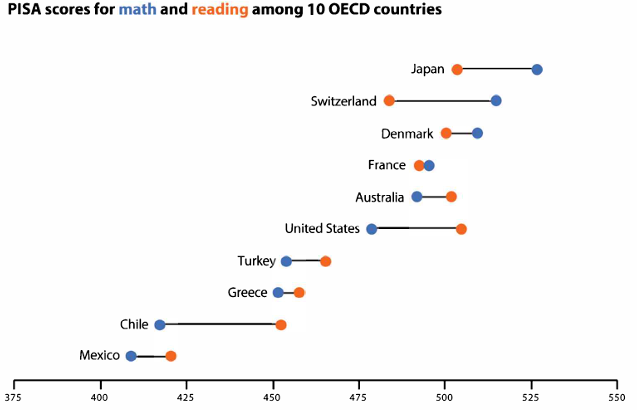
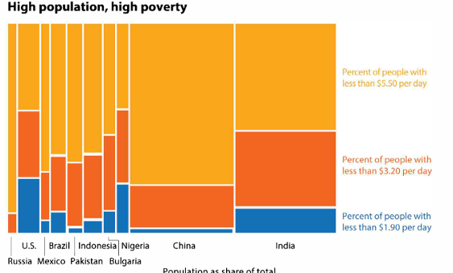
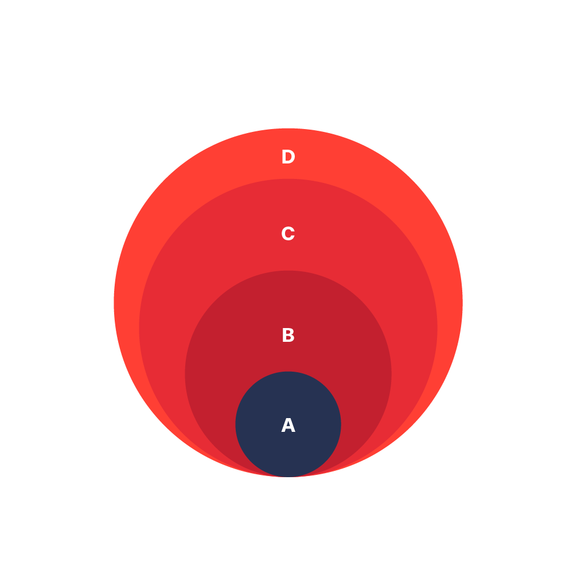

```{r setup, include=FALSE, echo=FALSE, warning=FALSE, message = FALSE}
#                      -=( Install & Load Package Function )=-
install_load <- function (package1, ...)  {   

   # convert arguments to vector
   packages <- c(package1, ...)

   # start loop to determine if each package is installed
   for(package in packages){

       # if package is installed locally, load
       if(package %in% rownames(installed.packages()))
          do.call('library', list(package))

       # if package is not installed locally, download, then load
       else {
          install.packages(package)
          do.call("library", list(package))
       }
   } 
}

install_load("knitr","ggplot2","viridis","dplyr","DT","stringr","scales","tidyr",
             "waffle","ggtext","lubridate","reshape2","calendR","plotly","ggforce"
             ,"ggalluvial","networkD3")

# Set wd 
opts_knit$set(root.dir = normalizePath("./"))

# Folder Chart
if (!dir.exists("Chart")) {
  dir.create("Chart")
}
```

# Materi Praktikum

{width="450"} {width="164"}

Materi praktikum ini merujuk pada **buku *Better Data Visualizations* karya Jonathan Schwabish**, yang membahas berbagai teknik visualisasi data untuk menyampaikan informasi secara lebih efektif dan intuitif.

Dalam praktikum ini, kita akan mengeksplorasi beberapa jenis visualisasi data utama, yaitu:

-   [Perbandingan Kategori](#perbandingan-kategori)
-   [Deret Waktu](#deret-waktu)
-   [Distribusi](#distribusi)
-   [Geospasial](#geospasial)

## Data

-   [Placement Prediction Dataset](https://www.kaggle.com/datasets/ruchikakumbhar/placement-prediction-dataset)

-   [Mobile Apps ScreenTime Analysis](https://www.kaggle.com/datasets/anandshaw2001/mobile-apps-screentime-analysis)

-   [Electric Vehicle Population](https://www.kaggle.com/datasets/fatmanur12/electric-vehicle-population)

-   [S&P 500, ETF, FX & Crypto (Daily updated)](https://www.kaggle.com/datasets/benjaminpo/s-and-p-500-with-dividends-and-splits-daily-updated?select=AAPL.csv)

-   [Discover Perspectives: HR Analytics Employee](https://www.kaggle.com/datasets/agungpambudi/workforce-perspectives-hr-employee-survey-analysis?select=employee-survey-insights-analysis.csv)

```{r}
data_ev <- read.csv("Data/EV_Population.csv")
data_survey <- read.csv("Data/employee-survey.csv", sep="|")
```

------------------------------------------------------------------------

# **Perbandingan Kategori** {#perbandingan-kategori}

## Bar Charts {#barchart .tabset}

Diagram batang digunakan untuk membandingkan kategori.

{width="169"}

### Advanced

```{r fig.height=5, fig.width=10, dpi=300}
# Sort
data_ev_sorted <- data_ev %>%
  count(Make, name = "count") %>%
  arrange(desc(count)) %>%
  mutate(Make = str_to_title(Make))

# Top 3
top3 <- head(data_ev_sorted$Make, 3)

# Viz
chart <- 
  ggplot(data_ev_sorted, 
         aes(x = reorder(Make, count), y = count, 
             fill = ifelse(Make %in% top3, "steelblue", "gray50"))) +
  # Bar chart
  geom_bar(stat = "identity", width = 0.8) + 
  scale_fill_identity() +  # Apply warna tanpa legend
  
  # Label ujung bar
  geom_text(aes(label = count), hjust = -0.2, size = 2.5) +
  
  # Settings
  geom_hline(yintercept = -0.3, color = "black", linewidth = 0.5) +  
  coord_flip() +
  theme_minimal() +
  
  labs(title = "Dominasi Tesla dalam Pasar Kendaraan Listrik",
       subtitle = "Frekuensi Pendaftaran Kendaraan Listrik dari Berbagai Brand",
       x = "", 
       y = "") +
  theme(axis.text.y = element_text(size = 8, hjust = 1, face = "bold", 
                                   margin = margin(r = -25)),
        plot.title = element_text(hjust = -0.17, size = 14, face = "bold"),
        plot.subtitle = element_text(hjust = -0.13, size = 8),
        panel.grid.major.y = element_blank(),
        panel.grid.major.x = element_line(linetype = "dashed"),
        panel.grid.minor.x = element_line(linetype = "dashed")
  )

chart

# Save Chart
ggsave("Chart/01_Bar.png", chart, dpi = 300, height = 5, width = 10)
```

### Sederhana

```{r fig.height=5, fig.width=10, dpi=300}
ggplot(data_ev, aes(x = Make)) +
  # Bar chart
  geom_bar(fill = "steelblue")
```

```{r fig.height=5, fig.width=10, dpi=300}
ggplot(data_ev_sorted, 
       aes(x = reorder(Make, count), y = count)) +
  # Bar chart
  geom_bar(stat = "identity", width = 0.8, fill = "steelblue") +
  coord_flip()
```

## Lolipop Chart {.tabset}

Variasi dari barchart

### Advanced

```{r fig.height=5, fig.width=10, dpi=300}
# Sort & Filter
data_ev_filtered <- data_ev %>%
  count(Make, name = "count") %>%
  filter(count > 2000) %>%  
  arrange(desc(count)) %>%
  mutate(Make = str_to_title(Make))  

# Top 3
top3 <- head(data_ev_filtered$Make, 3)

chart <-
  ggplot(data_ev_filtered, aes(x = reorder(Make, count), y = count)) +
  
  # Lolipop Stick
  geom_segment(aes(xend = Make, y = 0, yend = count), 
               color = ifelse(data_ev_filtered$Make %in% top3, 
                              "steelblue", "gray50"),
               linewidth = 1.5) +
  
  # Lolipop Head
  geom_point(size = 10, 
             pch = 19, 
             color = ifelse(data_ev_filtered$Make %in% top3, 
                            "steelblue", "gray50")) +
  
  # Label
  geom_text(aes(label = count), color = "white", size = 2.5, fontface = "bold") +
  
  # Tema dan layout
  coord_flip() +
  theme_minimal() +
  scale_color_identity() +  # Apply warna tanpa legend
  geom_hline(yintercept = -0.3, color = "black", linewidth = 0.5) +  
  
  labs(title = "Dominasi tesla dalam pasar kendaraan listrik",
       subtitle = "Hanya menampilkan brand dengan lebih 2000 kendaraan terdaftar",
       x = "", 
       y = "") +
  
  theme(axis.text.y = element_text(size = 8, hjust = 1, face = "bold", 
                                   margin = margin(r = -25)),
        plot.title = element_text(hjust = -0.05, size = 14, face = "bold"),
        plot.subtitle = element_text(hjust = -0.04, size = 8),
        panel.grid.major.y = element_blank(),
        panel.grid.major.x = element_line(linetype = "dashed"),
        panel.grid.minor.x = element_line(linetype = "dashed")
  )

chart

# Save Chart
ggsave("Chart/02_lolipop.png", chart, dpi = 300, height = 5, width = 10)
```

### Size

```{r fig.height=5, fig.width=10, dpi=300}
chart <-
  ggplot(data_ev_filtered, aes(x = reorder(Make, count), y = count)) +
  
  # Lolipop Stick
  geom_segment(aes(xend = Make, y = 0, yend = count), 
               color = ifelse(data_ev_filtered$Make %in% top3, "steelblue", "gray50"),
               linewidth = 1.5) +
  
  # Lolipop Head 
  geom_point(aes(size = count, 
                 color = ifelse(Make %in% top3, "steelblue", "gray50")), 
             pch = 19) +
  
  # Tema dan layout
  coord_flip() +
  theme_minimal() +
  scale_color_identity() +  # Apply warna tanpa legend
  scale_size_continuous(range = c(2, 14)) +  # Ukuran lebih besar
  geom_hline(yintercept = -0.3, color = "black", linewidth = 0.5) +  
  
  labs(title = "Dominasi Tesla dalam Pasar Kendaraan Listrik",
       subtitle = "Hanya Menampilkan Brand dengan Lebih 2000 Kendaraan Terdaftar",
       x = "", 
       y = "") +
  
  theme(axis.text.y = element_text(size = 8, hjust = 1, face = "bold", 
                                   margin = margin(r = -25)),
        plot.title = element_text(hjust = -0.05, size = 14, face = "bold"),
        plot.subtitle = element_text(hjust = -0.04, size = 8),
        panel.grid.major.y = element_blank(),
        panel.grid.major.x = element_line(linetype = "dashed"),
        panel.grid.minor.x = element_line(linetype = "dashed"),
        legend.position = "none"
  )

chart

# Save Chart
ggsave("Chart/02_lolipop_var.png", chart, dpi = 300, height = 5, width = 10)
```

### Sederhana

```{r fig.height=5, fig.width=10, dpi=300}
chart <-
  ggplot(data_ev_filtered, aes(x = reorder(Make, count), y = count)) +
  
  # Lolipop Stick
  geom_segment(aes(xend = Make, y = 0, yend = count), 
               color = "steelblue",
               linewidth = 1.5) +
  
  # Lolipop Head 
  geom_point(size = 10, color = "steelblue", pch = 19) +
  coord_flip()

chart
```

## Paired Bar {#paired-bar .tabset}

Membandingkan dua set kategori yang terkait.

{width="170"}

### Advanced 1

```{r fig.height=5, fig.width=12, dpi=300}
data_ev_grouped <- data_ev %>%
  count(Make, Electric.Vehicle.Type, name = "count") %>%
  filter(count > 1000) %>%
  arrange(desc(count)) %>%
  mutate(Make = str_to_title(Make))  # Kapitalisasi merek

# Top 3 merek berdasarkan total kendaraan
top3 <- data_ev_grouped %>%
  group_by(Make) %>%
  summarise(total = sum(count)) %>%
  arrange(desc(total)) %>%
  head(3) %>%
  pull(Make)

# Paired Bar Chart
chart <- ggplot(data_ev_grouped, 
                aes(x = reorder(Make, count), y = count, fill = Electric.Vehicle.Type)) +
  
  # Bar chart dengan posisi dodge untuk perbandingan antar kategori
  geom_bar(stat = "identity", position = "dodge", width = 0.8) +
  
  # Label di ujung bar
  geom_text(aes(label = count), position = position_dodge(width = 0.8), 
            hjust = -0.2, size = 3) +
  
  # Garis grid horizontal
  geom_hline(yintercept = -0.3, color = "black", linewidth = 0.5) +
  
  coord_flip() +
  theme_minimal() +
  
  # Warna berbeda untuk kategori kendaraan listrik
  scale_fill_manual(values = c("BEV" = "#6a3f48",
                               "PHEV" = "#caa847")) +
  
  labs(title = "Dominasi Tesla dalam Pasar Kendaraan Listrik",
       subtitle = "Frekuensi Pendaftaran Kendaraan Listrik BEV dan PHEV dari Berbagai Merek",
       fill = "Jenis Kendaraan",  # Label legend
       x = "", 
       y = "") +
  
  theme(axis.text.y = element_text(size = 8, hjust = 1, face = "bold", 
                                   margin = margin(r = -25)),
        plot.title = element_text(hjust = -0.06, size = 14, face = "bold"),
        plot.subtitle = element_text(hjust = -0.05, size = 8),
        panel.grid.major.y = element_blank(),
        panel.grid.major.x = element_line(linetype = "dashed"),
        panel.grid.minor.x = element_line(linetype = "dashed"),
        legend.text = element_text(size = 8),  
        legend.title = element_text(size = 8), 
        legend.key.size = unit(0.5, "cm")     
  )

chart

# Save Chart
ggsave("Chart/01_Bar_Paired.png", chart, dpi = 300, height = 5, width = 10)
```

### Advanced 2

```{r fig.height=5, fig.width=12, dpi=300}
data_ev_grouped <- data_ev %>%
  count(Make, CAFV.Eligibility.Simple, name = "count") %>%
  filter(count > 1000) %>%
  arrange(desc(count)) %>%
  mutate(Make = str_to_title(Make))  # Kapitalisasi merek

# Top 3 merek berdasarkan total kendaraan
top3 <- data_ev_grouped %>%
  group_by(Make) %>%
  summarise(total = sum(count)) %>%
  arrange(desc(total)) %>%
  head(3) %>%
  pull(Make)

# Paired Bar Chart
chart <- ggplot(data_ev_grouped, 
                aes(x = reorder(Make, count), y = count, fill = CAFV.Eligibility.Simple)) +
  
  # Bar chart dengan posisi dodge untuk perbandingan antar kategori
  geom_bar(stat = "identity", position = "dodge", width = 0.8) +
  
  # Label di ujung bar
  geom_text(aes(label = count), position = position_dodge(width = 0.8), 
            hjust = -0.2, size = 3) +
  
  # Garis grid horizontal
  geom_hline(yintercept = -0.3, color = "black", linewidth = 0.5) +
  
  coord_flip() +
  theme_minimal() +
  
  # Warna berbeda untuk kategori kendaraan listrik
  scale_fill_manual(values = c("Eligible" = "#88b07e",
                               "Not Eligible" = "#9c3b66")) +
  
  labs(title = "Dominasi Tesla dalam Pasar Kendaraan Listrik",
       subtitle = "Perbandingan Kelayakan Kendaraan Listrik di Berbagai Merek",
       fill = "Jenis Kendaraan",  # Label legend
       x = "", 
       y = "") +
  
  theme(axis.text.y = element_text(size = 8, hjust = 1, face = "bold", 
                                   margin = margin(r = -25)),
        plot.title = element_text(hjust = -0.06, size = 14, face = "bold"),
        plot.subtitle = element_text(hjust = -0.05, size = 8),
        panel.grid.major.y = element_blank(),
        panel.grid.major.x = element_line(linetype = "dashed"),
        panel.grid.minor.x = element_line(linetype = "dashed"),
        legend.text = element_text(size = 8),  
        legend.title = element_text(size = 8), 
        legend.key.size = unit(0.5, "cm")     
  )

chart

# Save Chart
ggsave("Chart/01_Bar_Paired.png", chart, dpi = 300, height = 5, width = 10)
```

### Sederhana

```{r fig.height=5, fig.width=10, dpi=300}
ggplot(data_ev, 
       aes(x = Make, fill=Electric.Vehicle.Type)) +
  # Bar chart
  geom_bar(position="dodge") +
  coord_flip()
```

## Stacked Bar {#stacked-bar .tabset}

Menampilkan perbandingan komposisi antar kategori.

{width="174"}

### Advanced Freq

```{r fig.height=5, fig.width=10, dpi=300}
data_ev_grouped <- data_ev %>%
  count(Make, CAFV.Eligibility.Simple, name = "count") %>%
  filter(count > 1000) %>%
  arrange(desc(count)) %>%
  mutate(Make = str_to_title(Make))  # Kapitalisasi merek

# Top 3 merek berdasarkan total kendaraan
top3 <- data_ev_grouped %>%
  group_by(Make) %>%
  summarise(total = sum(count)) %>%
  arrange(desc(total)) %>%
  head(3) %>%
  pull(Make)

# Paired Bar Chart
chart <- ggplot(data_ev_grouped, 
                aes(x = reorder(Make, count), y = count, fill = CAFV.Eligibility.Simple)) +
  
  # Bar chart dengan posisi dodge untuk perbandingan antar kategori
  geom_bar(stat = "identity", position = "stack", width = 0.8) +
  
  # Label di ujung bar
  geom_text(aes(label = count), 
            position = position_stack(vjust = 0.5), 
            size = 3, color = "white", fontface = "bold") +
  
  # Garis grid horizontal
  geom_hline(yintercept = -0.3, color = "black", linewidth = 0.5) +
  
  coord_flip() +
  theme_minimal() +
  
  # Warna berbeda untuk kategori kendaraan listrik
  scale_fill_manual(values = c("Eligible" = "#88b07e",
                               "Not Eligible" = "#9c3b66")) +
  
  labs(title = "Dominasi Tesla dalam Pasar Kendaraan Listrik",
       subtitle = "Perbandingan Kelayakan Kendaraan Listrik di Berbagai Merek",
       fill = "Jenis Kendaraan",  # Label legend
       x = "", 
       y = "") +
  
  theme(axis.text.y = element_text(size = 8, hjust = 1, face = "bold", 
                                   margin = margin(r = -25)),
        plot.title = element_text(hjust = -0.06, size = 14, face = "bold"),
        plot.subtitle = element_text(hjust = -0.05, size = 8),
        panel.grid.major.y = element_blank(),
        panel.grid.major.x = element_line(linetype = "dashed"),
        panel.grid.minor.x = element_line(linetype = "dashed"),
        legend.text = element_text(size = 8),  
        legend.title = element_text(size = 8), 
        legend.key.size = unit(0.5, "cm")     
  )

chart

# Save Chart
ggsave("Chart/01_Bar_Paired.png", chart, dpi = 300, height = 5, width = 10)
```

### Advanced %

```{r fig.height=5, fig.width=10, dpi=300}
data_ev_grouped <- data_ev %>%
  count(Make, CAFV.Eligibility.Simple, name = "count") %>%
  filter(sum(count) > 1000, .by = Make) %>%  # Pastikan hanya merek dengan total >1000 kendaraan
  arrange(desc(count)) %>%
  mutate(Make = str_to_title(Make))  # Kapitalisasi merek

# Hitung proporsi dalam setiap merek
data_ev_grouped <- data_ev_grouped %>%
  group_by(Make) %>%
  mutate(percentage = count / sum(count)) %>%
  ungroup()

# Stacked Bar Chart dengan Persentase
chart <- ggplot(data_ev_grouped, 
                aes(x = Make, y = percentage, fill = CAFV.Eligibility.Simple)) +
  
  # Bar chart full persentase
  geom_bar(stat = "identity", position = "fill", width = 0.8) +
  
  # Label di tengah bar dalam format persen
  geom_text(aes(label = scales::percent(percentage, accuracy = 1)), 
            position = position_fill(vjust = 0.5), 
            size = 3, color = "white", fontface = "bold") +
  
  # Grid horizontal
  geom_hline(yintercept = 0, color = "black", linewidth = 0.5) +
  
  coord_flip() +
  theme_minimal() +
  
  # Warna berbeda untuk kategori eligibility
  scale_fill_manual(values = c("Not Eligible" = "#9c3b66",
                               "Eligible" = "#88b07e")) +
  
  labs(title = "Dominasi Tesla dalam Pasar Kendaraan Listrik",
       subtitle = "Distribusi Persentase Kelayakan Kendaraan Listrik di Berbagai Merek",
       fill = "Jenis Kendaraan",
       x = "", 
       y = "Persentase") +
  
  scale_y_continuous(labels = scales::percent_format(accuracy = 1)) +  # Pastikan sumbu Y dalam persen
  
  theme(axis.text.y = element_text(size = 8, hjust = 1, face = "bold", 
                                   margin = margin(r = -25)),
        plot.title = element_text(hjust = -0.07, size = 14, face = "bold"),
        plot.subtitle = element_text(hjust = -0.06, size = 8),
        panel.grid.major.y = element_blank(),
        panel.grid.major.x = element_line(linetype = "dashed"),
        panel.grid.minor.x = element_line(linetype = "dashed"),
        legend.text = element_text(size = 8),  
        legend.key.size = unit(0.5, "cm"),
        legend.position = "top",
        legend.direction = "horizontal",
        legend.justification = c(-0.055, 0.5)
  ) +
  guides(fill = guide_legend(title = NULL))

chart

# Save Chart
ggsave("Chart/Stacked_Bar_Percentage.png", chart, dpi = 300, height = 5, width = 10)
```

### Sederhana

```{r fig.height=5, fig.width=10, dpi=300}
ggplot(data_ev, 
       aes(x = Make, fill=Electric.Vehicle.Type)) +
  # Bar chart
  geom_bar(position="stack") +
  coord_flip()
```

## Diverging Bar {#diverging-bar}

Menunjukkan distribusi kategori dengan skala positif-negatif.

{width="216"}

```{r}
# Buat mapping unik untuk setiap pertanyaan
question_map <- data_survey %>%
  distinct(Question) %>%
  mutate(Q_Label = paste0("Q.", str_pad(row_number(), 2, pad = "0")))  # Ubah ke dua digit

# Gabungkan kembali ke data asli
data_survey <- data_survey %>%
  left_join(question_map, by = "Question") %>%
  select(-Question) %>%
  rename(Question = Q_Label)  # Ganti dengan label baru

# Konversi teks ke angka menggunakan mutate + case_when()
data_survey_cleaned <- data_survey %>%
  
  # Filter hanya respon valid (hapus Not Applicable dan data kosong)
  filter(Response.Text != "Not Applicable", Response.Text != "") %>%
  
  # Ubah Response.Text menjadi angka
  mutate(Response.Value = case_when(
    Response.Text == "Strongly Agree" ~ 2,
    Response.Text == "Agree" ~ 1,
    Response.Text == "Disagree" ~ -1,
    Response.Text == "Strongly Disagree" ~ -2
  )) %>%
  
  # Hitung jumlah masing-masing respons per pertanyaan
  count(Question, Response.Text, Response.Value, name = "Count")

# Pastikan faktor dalam urutan yang benar
data_survey_cleaned <- data_survey_cleaned %>%
  mutate(Response.Text = factor(Response.Text, 
                                levels = c("Strongly Agree", "Agree", "Disagree", "Strongly Disagree")))

# Ubah sisi negatif untuk visualisasi divergen
data_survey_cleaned <- data_survey_cleaned %>%
  mutate(Count = ifelse(Response.Value < 0, -Count, Count)) %>%
  filter(Question != "Q.12") %>%
  mutate(Question = factor(Question, levels = rev(unique(Question))))
```

```{r fig.height=5, fig.width=10, dpi=300}
# Warna divergen
color_palette <- c("Strongly Agree" = "#08306b",
                   "Agree" = "#6baed6",
                   "Disagree" = "#fcae91",
                   "Strongly Disagree" = "#cb181d")

# Plot diverging bar chart dengan label frekuensi
ggplot(data_survey_cleaned, aes(x = Question, y = Count, fill = Response.Text)) +
  geom_bar(stat = "identity", position = "stack", width = 0.8) +
  scale_fill_manual(values = color_palette) +
  
  # Tambahkan label frekuensi di dalam bar
  geom_text(aes(label = abs(Count)), 
            position = position_stack(vjust = 0.5), 
            size = 3, color = "white", fontface = "bold") +

  coord_flip() +
  theme_minimal() +
  
  labs(title = "Survey Responses - Diverging Bar Chart",
       subtitle = "Distribusi Sentimen Responden Berdasarkan Pertanyaan",
       x = "", 
       y = "") +
  
  scale_y_continuous(breaks = seq(-50, 50, 10), labels = abs(seq(-50, 50, 10))) +  # Pastikan label y tetap positif
  theme(panel.grid.major.y = element_blank(),
        panel.grid.minor.y = element_blank(),
        panel.grid.major.x = element_line(linetype = "dashed"),
        legend.position = "top",
        legend.direction = "horizontal",
        legend.title = element_blank())  # Hilangkan judul legend
```

## Dot Plot {#dot-plot}

Digunakan untuk menunjukkan distribusi atau perbandingan antar kategori.

{width="308"}

```{r fig.height=5, fig.width=10, dpi=300}
# Buat dataset PISA
data_pisa <- data.frame(
  Country = c("Japan", "Switzerland", "Denmark", "France", "Australia", 
              "United States", "Turkey", "Greece", "Chile", "Mexico"),
  Math = c(532, 520, 509, 495, 503, 487, 454, 437, 423, 408), 
  Reading = c(520, 506, 497, 493, 499, 480, 460, 440, 420, 405)
)

# Ubah data ke format long untuk visualisasi dot plot
data_pisa_long <- data_pisa %>%
  pivot_longer(cols = c(Math, Reading), names_to = "Subject", values_to = "Score")

# Warna untuk kategori Math dan Reading
color_palette <- c("Math" = "#1f77b4", "Reading" = "#d62728")

# Plot dot plot
ggplot(data_pisa_long, aes(x = Score, y = reorder(Country, Score), color = Subject)) +
  geom_point(size = 4) +  # Titik
  geom_line(aes(group = Country), color = "black") +  # Garis penghubung antara dua titik
  scale_color_manual(values = color_palette) +  # Warna kategori
  theme_minimal() +
  labs(title = "PISA Scores for Math and Reading among 10 OECD Countries",
       x = "PISA Score",
       y = "",
       color = "Subject") +
  theme(legend.position = "top",
        legend.direction = "horizontal",
        plot.title = element_text(size = 14, face = "bold"),
        axis.text.y = element_text(face = "bold"))
```

## Marimekko and Mosaic Charts {#marimekko-mosaic}

Visualisasi untuk membandingkan proporsi dua variabel kategori.

{width="291"} {width="324"}

## Unit, Isotype, and Waffle Charts {#unit-chart}

Digunakan untuk menampilkan proporsi dalam bentuk ikon atau blok.

{width="203"} {width="269"} {width="201"}

### Unit Chart

```{r fig.height=3.5, fig.width=10, dpi=300}
# Buat dataset grid untuk tahun 2000 (100 kotak) dan tahun 2015 (57 kotak)
unit_2000 <- expand.grid(x = 1:10, y = 1:10) %>% 
  mutate(Year = "2000") %>% 
  slice(1:100)  # Ambil hanya 100 unit

unit_2015 <- expand.grid(x = 1:10, y = 1:10) %>% 
  mutate(Year = "2015") %>% 
  slice(1:57)  # Ambil hanya 57 unit

# Gabungkan dataset
unit_chart_data <- bind_rows(unit_2000, unit_2015)

# Plot Unit Chart
ggplot(unit_chart_data, aes(x = x, y = y, fill = Year)) +
  geom_tile(color = "white", size = 0.5) +
  scale_fill_manual(values = c("2000" = "orange", "2015" = "blue")) +
  labs(title = "Unit Chart: Poverty Reduction",
       subtitle = "Each square represents 1 million people",
       x = "", y = "") +
  facet_wrap(~Year, scales = "free") +  # Pisahkan per Tahun
  theme_void() +
  theme(legend.position = "none")  # Sembunyikan legend
```

### Waffle Chart

```{r fig.height=3.5, fig.width=10, dpi=300}
# Buat data proporsi
poverty_data <- c("Nigeria (54%)" = 54, "Ethiopia (27%)" = 27, "Others" = 19)

# Waffle Chart
waffle(poverty_data, rows = 10, colors = c("#E15759", "#F28E2B", "#BAB0AC")) +
  labs(title = "Waffle Chart: Poverty Distribution",
       subtitle = "Percentage of People in Extreme Poverty") +
  theme_minimal()
```

## Heatmap {#heatmap}

Visualisasi matriks yang menggunakan warna untuk mewakili nilai numerik.

{width="371"}

```{r fig.height=3.5, fig.width=10, dpi=300}
# Membuat data untuk 3 bulan (Januari-Maret 2024)
dates <- seq(as.Date("2024-01-01"), as.Date("2024-03-31"), by = "day")
set.seed(123)
data <- data.frame(
  date = dates,
  value = runif(length(dates), 0, 100)
)

# Menambahkan informasi hari dan minggu
data <- data %>%
  mutate(
    weekday = wday(date, week_start = 1), # 1 = Senin sebagai awal minggu
    week = week(date),
    month = format(date, "%B"),
    monthweek = as.numeric(format(date, "%W")) - 
                as.numeric(format(as.Date(paste0(format(date, "%Y-%m"), "-01")), "%W")) + 1
  )

# Membuat plot
ggplot(data, aes(x = weekday, y = monthweek, fill = value)) +
  geom_tile(color = "white", size = 0.1) +
  scale_fill_gradient(low = "#e5f5f9", high = "#2ca25f") +
  facet_wrap(~month, ncol = 3, scales = "free") +
  scale_x_continuous(
    breaks = 1:7,
    labels = c("Su", "Mo", "Tu", "We", "Th", "Fr", "Sa"),
    expand = c(0, 0)
  ) +
  scale_y_reverse(expand = c(0, 0)) +
  theme_minimal() +
  theme(
    axis.title = element_blank(),
    panel.grid = element_blank(),
    legend.position = "none",
    strip.text = element_text(size = 12, face = "bold"),
    plot.background = element_rect(fill = "white", color = NA),
    panel.background = element_rect(fill = "white", color = NA)
  ) +
  labs(title = "Calendar Heatmap")
```

```{r fig.height=3.5, fig.width=10, dpi=300}
# Alternative menggunakan package calendR
# Membuat tiga kalender terpisah
calendR(year = 2024, month = 1, 
        special.days = runif(31, 0, 100),
        gradient = TRUE,
        low.col = "#e5f5f9",
        special.col = "#2ca25f",
        title = "January 2024")

calendR(year = 2024, month = 2, 
        special.days = runif(29, 0, 100),
        gradient = TRUE,
        low.col = "#e5f5f9",
        special.col = "#2ca25f",
        title = "February 2024")

calendR(year = 2024, month = 3, 
        special.days = runif(31, 0, 100),
        gradient = TRUE,
        low.col = "#e5f5f9",
        special.col = "#2ca25f",
        title = "March 2024")
```

## Gauge and Bullet Charts {#gauge-bullet}

Menampilkan pengukuran dalam format indikator atau skala.

{width="469"}

```{r fig.height=3.5, fig.width=10, dpi=300}
# Buat Data Bullet Chart
bullet_data <- data.frame(
  Category = c("ALL", "Furniture", "Office Supplies", "Technology"),
  Target = c(1400000, 500000, 400000, 500000),
  Actual = c(900000, 350000, 300000, 400000),
  Range1 = c(500000, 200000, 150000, 250000),
  Range2 = c(1000000, 400000, 300000, 450000)
)

# Plot Bullet Chart
ggplot(bullet_data, aes(y = Category)) +
  geom_bar(aes(x = Target), stat = "identity", fill = "#D5E5A3", width = 0.6) +  
  geom_bar(aes(x = Range2), stat = "identity", fill = "#F4D03F", width = 0.6) +  
  geom_bar(aes(x = Range1), stat = "identity", fill = "#E74C3C", width = 0.6) +  
  geom_bar(aes(x = Actual), stat = "identity", fill = "black", width = 0.2) +  
  theme_minimal() +
  labs(title = "Bullet Chart: Target vs Actual", x = "Nilai (K)", y = "") +
  scale_x_continuous(labels = scales::comma)

```

## Bubble Comparison and Nested Bubbles {#bubble-chart}

Digunakan untuk menunjukkan hierarki atau hubungan antar data.

{width="214"} {width="189"}

```{r fig.height=5, fig.width=10, dpi=300}
# Buat data contoh
bubble_data <- data.frame(
  Country = c("India", "Nigeria", "China", "Congo", "Indonesia", "Tanzania", "Kenya"),
  Population = c(208.1, 64.8, 100, 53.2, 15.1, 24.1, 17.8),
  PovertyRate = c(15, 16, 12, 18, 14, 17, 15)
)

# Warna berdasarkan tingkat kemiskinan
bubble_data$Color <- ifelse(bubble_data$PovertyRate >= 14.5, "orange", "blue")

# Plot Bubble Comparison
ggplot(bubble_data, aes(x = Population, y = PovertyRate, size = Population, fill = Color)) +
  geom_point(shape = 21, alpha = 0.7, color = "black") +
  scale_size(range = c(5, 25)) +
  scale_fill_manual(values = c("orange" = "orange", "blue" = "blue")) +
  geom_text(aes(label = Country), vjust = 1, color = "black", size = 5) +
  theme_minimal() +
  labs(title = "Bubble Comparison: Number of People in Poverty",
       subtitle = "Orange: Poverty rate > 14.5%, Blue: Poverty rate < 14.5%",
       x = "Population (millions)",
       y = "Poverty Rate (%)") +
  theme(legend.position = "none")
```

## Sankey Diagram {#sankey}

Diagram aliran yang menunjukkan hubungan antar kategori.

{width="259"} {width="254"}

```{r fig.height=5, fig.width=10, dpi=300}
# Contoh data untuk aliran dukungan keuangan
sankey_data <- data.frame(
  Source = c("Germany", "Germany", "Germany", "Germany", "Germany", 
             "UK", "UK", "UK", "UK", "UK", 
             "US", "US", "US", "US", "US"),
  Target = c("Sub-Saharan Africa", "Southern and Central Asia", "Other Asia and Oceania", 
             "Middle East and North Africa", "Europe",
             "Sub-Saharan Africa", "Southern and Central Asia", "Other Asia and Oceania", 
             "Latin America and Caribbean", "Europe",
             "Sub-Saharan Africa", "Southern and Central Asia", "Middle East and North Africa", 
             "Latin America and Caribbean", "Europe"),
  Value = c(10, 15, 20, 30, 25, 12, 18, 14, 28, 28, 22, 16, 19, 23, 20)
)

# Plot Sankey Diagram menggunakan ggalluvial
ggplot(sankey_data, aes(axis1 = Source, axis2 = Target, y = Value)) +
  geom_alluvium(aes(fill = Source), width = 1/12) +
  geom_stratum(width = 1/12, fill = "gray") +
  geom_text(stat = "stratum", aes(label = after_stat(stratum)), size = 5) +
  theme_minimal() +
  labs(title = "Aliran Dukungan Keuangan",
       subtitle = "Dari Jerman, Inggris, dan AS ke Berbagai Wilayah Dunia",
       x = NULL, y = "Persentase Dukungan") +
  theme(legend.position = "none")
```

## Waterfall Chart {#waterfall}

Menunjukkan perubahan nilai dalam urutan kumulatif.

{width="244"}

## Conclusion

Ringkasan konsep perbandingan kategori.

------------------------------------------------------------------------
