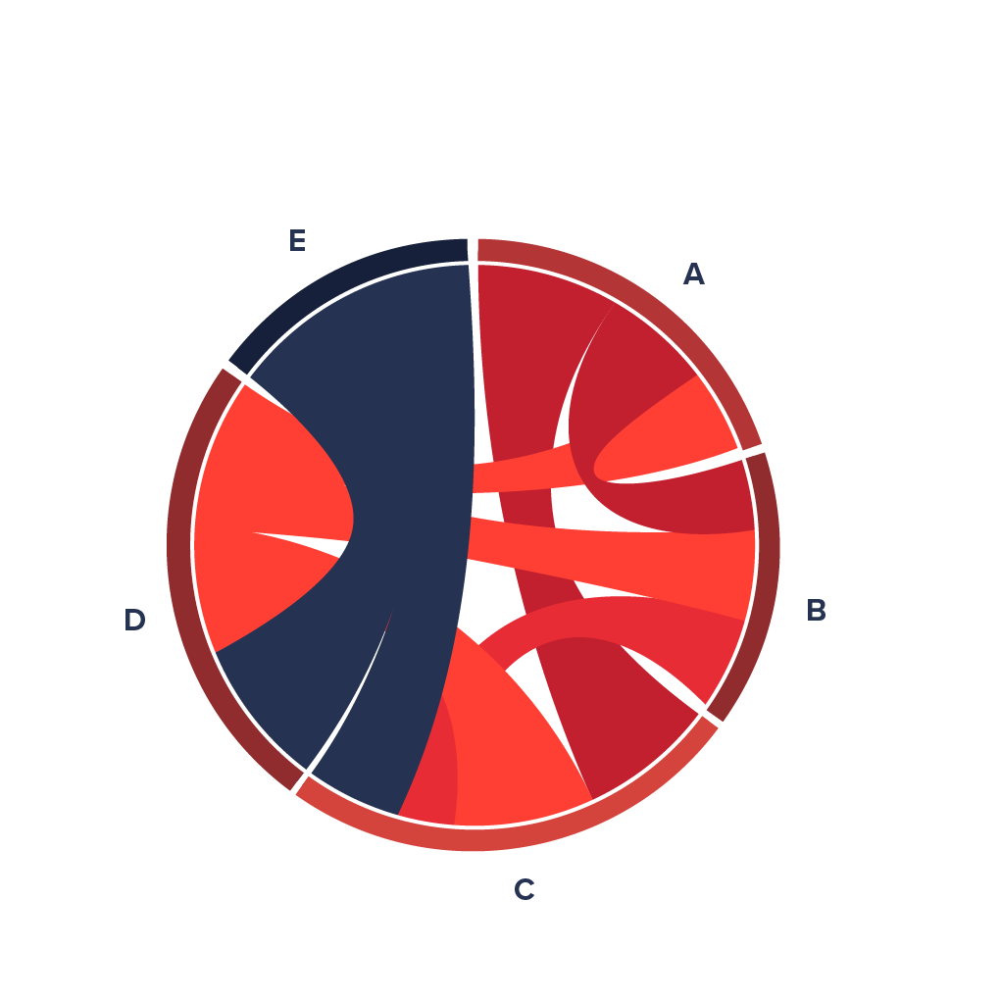

```{r setup, include=FALSE, echo=FALSE, warning=FALSE, message = FALSE}
#                      -=( Install & Load Package Function )=-
install_load <- function (package1, ...)  {   

   # convert arguments to vector
   packages <- c(package1, ...)

   # start loop to determine if each package is installed
   for(package in packages){

       # if package is installed locally, load
       if(package %in% rownames(installed.packages()))
          do.call('library', list(package))

       # if package is not installed locally, download, then load
       else {
          install.packages(package)
          do.call("library", list(package))
       }
   } 
}

install_load("knitr","ggplot2","viridis","dplyr","DT","showtext","ggrepel",
             "GGally","tibble","scales","tidyverse","fmsb","devtools")

# Set wd 
opts_knit$set(root.dir = normalizePath("./"))

# Folder Chart
if (!dir.exists("Chart")) {
  dir.create("Chart")
}

# Add Google Fonts 
font_add_google("Lato", "lato")
showtext_auto()
```

# Materi Praktikum

# **Praktikum Pekan 3: Visualisasi Data**

{width="450"} {width="164"}

Materi praktikum ini mengacu pada **buku *Better Data Visualizations* karya Jonathan Schwabish**, yang membahas berbagai teknik visualisasi data untuk menyampaikan informasi secara lebih efektif.

Dalam pekan ini, kita akan mengeksplorasi beberapa teknik visualisasi untuk memahami hubungan antar variabel, proporsi dalam data, analisis data kualitatif, serta penyajian data dalam tabel.

## **Navigasi Materi**

-   [Relationship](#relationship)
-   [Part-to-Whole](#part-to-whole)
-   [Qualitative](#qualitative)
-   [Tables](#tables)

## Data

Data yang akan digunakan adalah

```{r}
# Data
data_cars <- mtcars %>%
  mutate(
    cyl = as.factor(cyl),   
    gear = as.factor(gear), 
    carb = as.factor(carb),
    cc = disp * 16.3871, # konversi volume mesin ke cc
    engine = factor(ifelse(vs == 0, "V-Engine", "Inline")),
    trans = factor(ifelse(am == 0, "Automatic", "Manual"))
  ) %>% 
  rownames_to_column(var = "car_name") %>% 
  select(-disp, -vs, -am) 
  
head(data_cars)
```

------------------------------------------------------------------------

# **Relationship** {#relationship}

Hubungan antar variabel dalam data dapat divisualisasikan menggunakan berbagai teknik yang membantu memahami korelasi dan pola tersembunyi.

## Scatterplot {#scatterplot .tabset}

{width="168"}

{width="168"}

Scatterplot digunakan untuk menunjukkan hubungan antara dua variabel numerik.

```{r}
# Pilih 3 mobil yang akan di-highlight
label_cars <- bind_rows(
  # Mobil paling irit
  data_cars %>% slice_max(mpg, n = 1, with_ties = FALSE), 
  
  # Mobil menengah
  data_cars %>% 
    mutate(dist_to_median = abs(mpg - median(mpg))) %>%   
    slice_min(dist_to_median, n = 1, with_ties = FALSE) %>%  
    select(-dist_to_median),  
  
  # Mobil paling boros
  data_cars %>% slice_min(mpg, n = 1, with_ties = FALSE)  
) %>%
  arrange(desc(mpg)) 

colors <- c("#21637b", "#967349", "#ad0c1b")
```

### Advanced

```{r fig.height=5, fig.width=8, dpi=300}
# viz
chart <-
ggplot(data_cars,
       aes(x = cc, y = mpg, 
           fill = factor(cyl), color = factor(cyl), 
           shape = factor(trans), size = hp)) +  
  
  # Scatterplot
  geom_point(stroke = 1, alpha = 0.5) +  
  
  # Aes
  scale_shape_manual(values = c(21, 23)) +
  scale_size_continuous(range = c(1, 10)) +
  scale_fill_manual(values = colors) +  
  scale_color_manual(values = colors) +
  
  # Label
  geom_text_repel(
    data = label_cars, aes(label = car_name), 
    size = 6, fontface = "bold", color = "black", 
    box.padding = 0.5, point.padding = 0.5, 
    nudge_x = 15, 
    nudge_y = 2,
    segment.color = "black", segment.size = 0.5, 
    arrow = arrow(length = unit(0.01, "npc"))
  ) +
  
  # Setting 
  labs(title = "Efek Mesin & Transmisi terhadap Efisiensi BBM",
       subtitle = "(Ukuran simbol menunjukkan tenaga mesin (hp))",
       x = "Kapasitas Mesin (cc)",
       y = "← Boros          Efisiensi BBM          Irit →",
       color = "Jumlah Silinder") +
  
  guides(
    size = "none", 
    fill = "none",
    shape = guide_legend(title = NULL)
  ) + 
  
  theme_minimal(base_size = 35) + # Global Font size
  theme(
    axis.title.y = element_text(size = 30, face = "bold"),
    axis.text.y = element_text(hjust = 1, face = "bold", 
                               margin = margin(r = 1)),
    plot.title = element_text(hjust = -0.2, face = "bold",
                              margin = margin(b = 5)),
    plot.subtitle = element_text(hjust = -0.115, size=25),
    
    # Garis
    panel.grid.major.y = element_blank(),
    panel.grid.minor.y = element_blank(),
    panel.grid.major.x = element_blank(),
    panel.grid.minor.x = element_blank(),
    axis.line = element_line(linewidth = 0.5, colour = "black"),
    
    # Legend
    legend.title = element_text(size = 30),
    legend.position = "top",
    legend.direction = "horizontal",
    legend.justification = c(-0.25, 0),
    legend.margin = margin(t = -10, b = -25), 
    legend.text = element_text(margin = margin(r = -1, l = -1))
  ) 

chart

# Simpan Chart
ggsave("Chart/01_Scatterplot.png", chart, dpi = 300, height = 5, width = 9)
```

### Sederhana

```{r fig.height=5, fig.width=8, dpi=300}
ggplot(data_cars, aes(x = cc, y = mpg)) +  
  # Scatterplot
  geom_point() +
  theme_gray(base_size = 35) #efek pake font google
```

## Parallel Coordinates Plot {#parallel-coordinates-plot .tabset}

{width="168"}

Visualisasi ini digunakan untuk menganalisis hubungan beberapa variabel numerik sekaligus.

```{r}
# Pilih kolom
selected_columns <- c("mpg", "hp", "drat", "wt", "qsec", "cc")

new_labels <- c("Efisiensi BBM", "Tenaga", "Rasio Driveshaft", 
                "Berat Mobil", "Waktu 1/4 Mil", "Kapasitas Mesin")

# HIGHTLIGHT---------------------------------
highlight_cars <- function(data, col) {
  selected <- bind_rows(
    # Mobil dengan nilai tertinggi
    data %>% slice_max({{col}}, n = 1, with_ties = FALSE),  
    
    # Mobil dengan nilai median terdekat
    data %>% mutate(dist_to_median = abs({{col}} - median({{col}}))) %>% 
      slice_min(dist_to_median, n = 1, with_ties = FALSE) %>% 
      select(-dist_to_median),  
    
    # Mobil dengan nilai terendah
    data %>% slice_min({{col}}, n = 1, with_ties = FALSE)  
  ) %>%
    arrange(desc({{col}}))  
  
  return(selected)
}

# Pilih 3 mobil yang akan di-highlight
label_cars <- highlight_cars(data_cars, mpg)  # Berdasarkan efisiensi BBM

# Tambahkan kolom highlight dan alpha transparansi
data_cars <- data_cars %>%
  mutate(
    highlight = ifelse(car_name %in% label_cars$car_name, car_name, "Lainnya"),
    highlight = factor(highlight, levels = c(label_cars$car_name, "Lainnya")),
    alpha_val = ifelse(highlight == "Lainnya", 0.2, 1)
  )

# Warna khusus: 3 mobil utama + lainnya dalam warna abu-abu
highlight_colors <- c("#21637b", "#967349", "#ad0c1b", "#E8E8E8")  
color_mapping <- setNames(highlight_colors, levels(data_cars$highlight))


# NORMALISASI DATA ---------------------------------
# **Normalisasi data ke skala 0-1 secara manual**
data_cars_norm <- data_cars %>%
  mutate(across(all_of(selected_columns), rescale))

# **Pastikan label_positions memiliki skala yang sudah dinormalisasi**
label_positions <- data_cars_norm %>%
  filter(car_name %in% label_cars$car_name) %>%
  select(car_name, cc, highlight)  # Tambahkan highlight agar sesuai dengan warna

x_max <- length(selected_columns) + 0.3  # Posisi label di ujung sumbu
```

### Advanced 1

Highlight 3 mobil berdasarkan Efisiensi bahan bakar.

```{r fig.height=5, fig.width=9, dpi=300}
# PLOT
chart <- 
ggparcoord(data_cars_norm, 
           columns = match(selected_columns, colnames(data_cars_norm)),   
           groupColumn = "highlight",          
           scale = "uniminmax",  
           showPoints = TRUE,    
           alphaLines = 0.6) +   
  
  # Warna
  scale_color_manual(values = color_mapping, guide = "none") +  
  scale_alpha_identity() +  
  
  # TEXT ----------------
  # Judul
  labs(title = "Perbandingan Karakteristik Mobil Berdasarkan Efisiensi BBM",
       x = NULL,  
       y = NULL) +
  
  # Ganti label sumbu x
  scale_x_discrete(labels = new_labels) +

  # **Tambahkan label di ujung garis & geser lebih ke kiri**
  geom_text(data = label_positions, 
            aes(x = x_max - 0.2, y = cc, label = car_name, color = highlight), 
            fontface = "bold", size = 8, hjust = 0, inherit.aes = FALSE) +

  
  # THEME -------------------
  # Hapus Legend
  guides(color = "none") +

  # **Styling tema**
  theme_minimal(base_size = 35) +  
  theme(
    axis.title.y = element_text(size = 24, face = "bold"),
    axis.text.y = element_text(hjust = 1, face = "bold", 
                               margin = margin(r = -30), size = 22),
    plot.title = element_text(hjust = 0, face = "bold", size = 30),

    # **Pertebal grid utama**
    panel.grid.major = element_line(linewidth = 0.5),  
    panel.grid.minor = element_line(linewidth = 0.3),
    panel.grid.major.y = element_blank(),
    panel.grid.minor.y = element_blank()
  ) + 
  coord_cartesian(clip = "off")

chart 

# Simpan Chart
ggsave("Chart/02_Paralell-Coordinates.png", 
       chart, dpi = 300, height = 5, width = 9)
```

### Advanced 2

Hightlight mobil berdasarkan tenaga.

```{r}
# Pilih 3 mobil yang akan di-highlight
label_cars <- highlight_cars(data_cars, hp)  # Berdasarkan tenaga

# Tambahkan kolom highlight dan alpha transparansi
data_cars <- data_cars %>%
  mutate(
    highlight = ifelse(car_name %in% label_cars$car_name, car_name, "Lainnya"),
    highlight = factor(highlight, levels = c(label_cars$car_name, "Lainnya")),
    alpha_val = ifelse(highlight == "Lainnya", 0.2, 1)
  )

# Warna khusus: 3 mobil utama + lainnya dalam warna abu-abu
highlight_colors <- c("#21637b", "#967349", "#ad0c1b", "#E8E8E8")  
color_mapping <- setNames(highlight_colors, levels(data_cars$highlight))


# NORMALISASI DATA ---------------------------------
# **Normalisasi data ke skala 0-1 secara manual**
data_cars_norm <- data_cars %>%
  mutate(across(all_of(selected_columns), rescale))

# **Pastikan label_positions memiliki skala yang sudah dinormalisasi**
label_positions <- data_cars_norm %>%
  filter(car_name %in% label_cars$car_name) %>%
  select(car_name, cc, highlight)  # Tambahkan highlight agar sesuai dengan warna

x_max <- length(selected_columns) + 0.3  # Posisi label di ujung sumbu
```

```{r fig.height=5, fig.width=9, dpi=300}
# PLOT
chart <- 
ggparcoord(data_cars_norm, 
           columns = match(selected_columns, colnames(data_cars_norm)),   
           groupColumn = "highlight",          
           scale = "uniminmax",  
           showPoints = TRUE,    
           alphaLines = 0.6) +   
  
  # Warna
  scale_color_manual(values = color_mapping, guide = "none") +  
  scale_alpha_identity() +  
  
  # TEXT ----------------
  # Judul
  labs(title = "Perbandingan Karakteristik Mobil Berdasarkan Tenaga",
       x = NULL,  
       y = NULL) +
  
  # Ganti label sumbu x
  scale_x_discrete(labels = new_labels) +

  # **Tambahkan label di ujung garis & geser lebih ke kiri**
  geom_text(data = label_positions, 
            aes(x = x_max - 0.2, y = cc, label = car_name, color = highlight), 
            fontface = "bold", size = 8, hjust = 0, inherit.aes = FALSE) +

  
  # THEME -------------------
  # Hapus Legend
  guides(color = "none") +

  # **Styling tema**
  theme_minimal(base_size = 35) +  
  theme(
    axis.title.y = element_text(size = 24, face = "bold"),
    axis.text.y = element_text(hjust = 1, face = "bold", 
                               margin = margin(r = -30), size = 22),
    plot.title = element_text(hjust = 0, face = "bold", size = 30),

    # **Pertebal grid utama**
    panel.grid.major = element_line(linewidth = 0.5),  
    panel.grid.minor = element_line(linewidth = 0.3),
    panel.grid.major.y = element_blank(),
    panel.grid.minor.y = element_blank()
  ) + 
  coord_cartesian(clip = "off")

chart 

# Simpan chart
ggsave("Chart/02_Paralell-Coordinates-2.png", 
       chart, dpi = 300, height = 5, width = 9)
```

### Sederhana

```{r fig.height=5, fig.width=9, dpi=300}
ggparcoord(data_cars, 
           columns = match(selected_columns, colnames(data_cars)),  
           groupColumn = "cyl",
           scale = "uniminmax") +
  theme_gray(base_size = 35)
```

## Radar Charts {#radar-charts}

{width="167"}

Sering digunakan untuk membandingkan beberapa kategori dengan beberapa atribut dalam satu grafik.

```{r}
# Install dulu :
## devtools::install_github("ricardo-bion/ggradar")
library(ggiraphExtra)

# Normalisasi data numerik agar berada di rentang [0,1]
normalize <- function(x) {
  (x - min(x)) / (max(x) - min(x))
}

# Normalisasi dan filter hanya mobil yang kita butuhkan
data_cars_norm <- data_cars %>%
  mutate(across(c(mpg, hp, drat, wt, qsec, cc), normalize)) %>%
  filter(car_name %in% c("Mazda RX4", "Datsun 710", "Hornet 4 Drive"))

# Pastikan data dalam format wide dengan car_name sebagai faktor
data_radar <- data_cars_norm %>%
  select(car_name, mpg, hp, drat, wt, qsec, cc) %>%
  as_tibble()

```

### Advanced

```{r}

```

### Sederhana

```{r fig.height=5, fig.width=8, dpi=300}
ggRadar(data=iris,aes(group=Species))
```

```{r}
ggRadar(data=mtcars,interactive=TRUE)
```

```{r}
ggRadar(data=mtcars,aes(colour=am,facet=cyl),interactive=TRUE)
```

```{r}
ggRadar(iris, aes(x=c(Sepal.Length, Sepal.Width, Petal.Length, Petal.Width)))
```

```{r fig.height=5, fig.width=8, dpi=300}
# Normalisasi data numerik untuk radar chart
normalize <- function(x) {
  (x - min(x)) / (max(x) - min(x)) * 10
}

data_cars_norm <- data_cars %>% 
  mutate(across(c(mpg, hp, drat, wt, qsec, cc), normalize))

# Menyiapkan data untuk fmsb
max_min <- data.frame(
  matrix(rep(c(10, 0), 
             each = ncol(data_cars_norm) - 1), 
         nrow = 2, byrow = TRUE)
  )
colnames(max_min) <- colnames(data_cars_norm)[-1]

data_selected <- data_cars_norm %>% 
  filter(car_name %in% c("Mazda RX4", "Datsun 710", "Hornet 4 Drive"))
data_radar <- rbind(max_min, data_selected[-1])

# Plot radar chart
radarchart(data_radar,
           axistype = 1,        # Menampilkan nilai pada sumbu
           caxislabels = c("0", "2", "4", "6", "8", "10"), # Ubah label sumbu
           calcex = 1.2,        # Ukuran font untuk label sumbu
           cglty = 1,           # Grid line type
           cglcol = "gray",     # Grid line color
           pcol = c("red", "blue", "green"), # Warna garis untuk tiap mobil
           plwd = 2,            # Ketebalan garis
           plty = 1,            # Tipe garis
           pfcol = c(rgb(1, 0, 0, 0.25), # Warna isi
                     rgb(0, 0, 1, 0.25), 
                     rgb(0, 1, 0, 0.25)))  

legend("topright", 
       legend = c("Mazda RX4", "Datsun 710", "Hornet 4 Drive"),
       bty = "n", 
       pch = 20, 
       col = c("red", "blue", "green"),
       text.col = "grey25", 
       pt.cex = 2,  # Ukuran simbol dalam legenda
       cex = 1.5)   # Ukuran font pada legenda
```

## Chord Diagram {#chord-diagram}

{width="166"}

Diagram yang digunakan untuk menunjukkan hubungan antara beberapa kategori yang saling berhubungan.

## Arc Chart {#arc-chart}

{width="162"}

Menampilkan koneksi antar elemen dalam dataset dengan menggunakan kurva.

## Correlation Matrix {#correlation-matrix}

{width="310"}

Digunakan untuk menunjukkan hubungan antara banyak variabel dalam bentuk matriks.

## Network Diagrams {#network-diagrams}

{width="184"}

Visualisasi hubungan antar entitas dalam bentuk jaringan.

## Tree Diagrams {#tree-diagrams}

{width="176"}

Menampilkan hubungan hierarkis dalam data.

------------------------------------------------------------------------

# **Part-to-Whole** {#part-to-whole}

Teknik visualisasi ini digunakan untuk menunjukkan bagaimana suatu bagian berkontribusi terhadap keseluruhan.

## Pie Charts {#pie-charts}

{width="179"} {width="180"}

Diagram lingkaran yang digunakan untuk menunjukkan distribusi persentase suatu kategori.

## Treemap {#treemap}

{width="189"} {width="188"}

Menampilkan hierarki data dalam bentuk persegi panjang bersarang.

## Sunburst Diagram {#sunburst-diagram}

{width="186"} {width="186"}

Mirip dengan treemap, tetapi berbentuk melingkar untuk menunjukkan hierarki.

## Nightingale Chart {#nightingale-chart}

{width="183"}

Variasi dari pie chart yang digunakan untuk menampilkan data dalam bentuk radial.

## Voronoi Diagram {#voronoi-diagram}

{width="204"}

Membagi ruang menjadi wilayah berdasarkan kedekatan titik-titik data.

------------------------------------------------------------------------

# **Qualitative** {#qualitative}

Visualisasi data kualitatif membantu menyampaikan informasi yang lebih deskriptif.

## Word Clouds and Specific Words {#word-clouds}

{width="198"}

Menampilkan distribusi kata dalam teks berdasarkan frekuensi penggunaannya.

## Word Trees {#word-trees}

{width="201"}

Menampilkan struktur hierarki dari kata atau frasa dalam teks.
